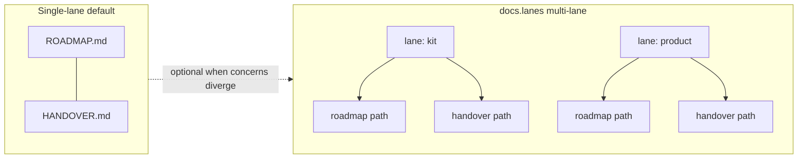
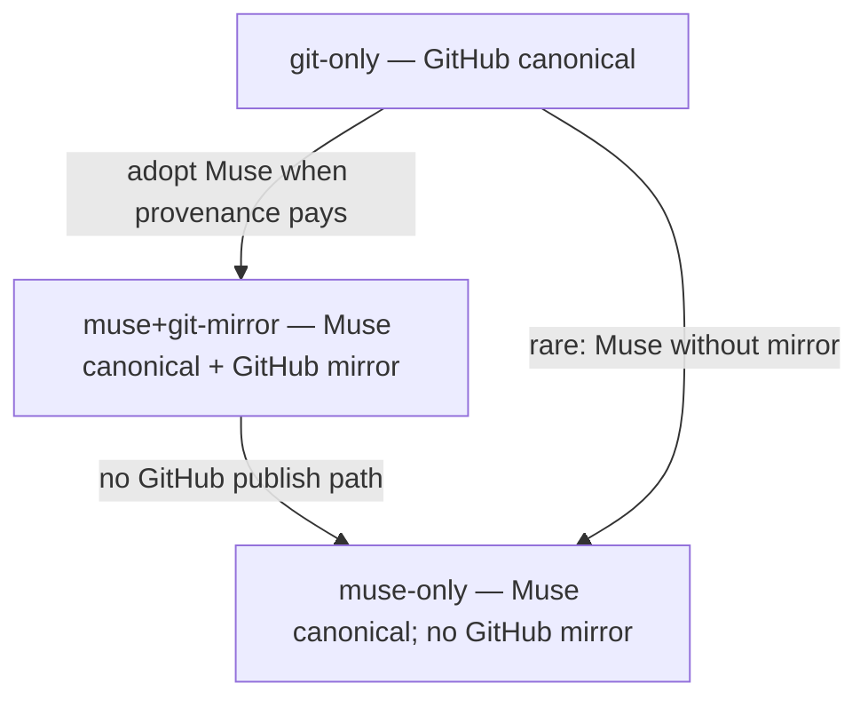
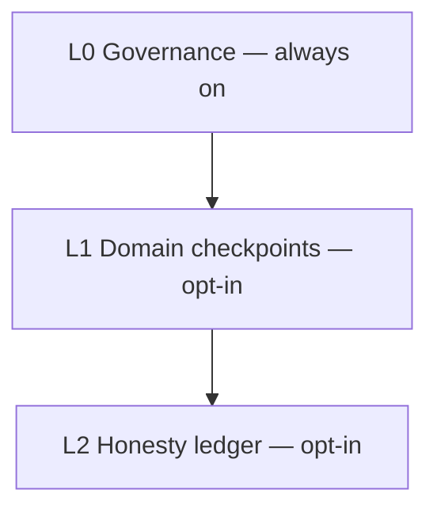
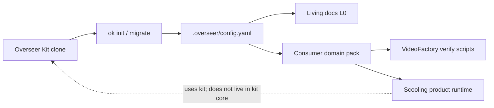

# Phase Track Q / Q4a — Freeze Path B UI redesign (Thinking freeze)

Status: **Reviewed → `pass` (Q4a-r2).** Q4a Thinking is **spec-only** and now frozen; no static UI,
CSS, JS, SVG, or desktop shell edits land in this phase. The Track Q / Q4b Auto build (`{step}b`)
is cleared to start mechanically against this frozen contract; it is the only phase that rewrites
`tools/app/static/` presentation. Do **not** re-derive this contract during the Auto build. Do
**not** reopen closed Q0 `api/*`, bind, or auth contracts.

```yaml
phase: TRACK-Q-Q4A
outputs:
- id: track-q-q4a-ui-redesign
  path: docs/archive/phases/PHASE-TRACK-Q-Q4A-UI-REDESIGN.md
  frozen: true
frozen_inputs:
- id: q0-overseer-app
  path: docs/archive/phases/PHASE-TRACK-Q-Q0-OVERSEER-APP.md
- id: q2a-ok-entrypoint
  path: docs/archive/phases/PHASE-TRACK-Q-Q2A-OK-CLI-ENTRYPOINT.md
- id: consumer-adapter-pattern
  path: docs/CONSUMER-ADAPTER-PATTERN.md
- id: layered-honesty-vision
  path: docs/archive/thinking/OVERSEER-KIT-LAYERED-HONESTY-VISION.md
- id: landing-hosting
  path: docs/landing/HOSTING.md
- id: k12-landing
  path: docs/archive/phases/PHASE-K12-TRACK-N-LANDING-CONTRACT.md
- id: k8-multi-lane
  path: docs/archive/phases/PHASE-K8-MULTI-LANE-DOCS-CONTRACT.md
- id: kit-spec-freeze
  path: docs/OVERSEER-KIT-SPEC.md#6
- id: kit-boundary
  path: AGENTS.md
- id: test-tiers
  path: policy/test-tiers.yaml
- id: decision-tiers
  path: policy/tiers.yaml
- id: roadmap-track-q-rows
  path: docs/ROADMAP.md
review_stamp:
  reviewed_at: '2026-07-14T03:34:48Z'
  verdict: pass
  reviewer_mode: agent
  reviewer_model: thinking-high
  reviewer_provider: local
  kit_version: 0.1.0
  artifact_digest: sha256:ea118134c2851f7dc6d7fadf02f6036a5ac0eaf7c826be033d79d5e8f70c32ed
```

**Downstream edge:** the Track Q / Q4b Path B UI redesign Auto build treats this document as
ground truth without re-deriving it (SPEC §6 mandatory reviewed freeze). Path C (`desktop/`)
consumes the same loopback UI bytes after Q4b — packaging presentation stays title-only unless
§Q4A.10 requires a one-line string parity. Hosted governance dashboard and `docs/landing/` are
**different surfaces**; this freeze may cite them for copy parity but does not redesign them
except the optional landing CTA alignment note in §Q4A.11.

**Review record (§6.2):** every freeze-review finding MUST cite **file+line** per SPEC §6; uncited
findings are invalid and are discarded. Fixes applied during the loop are Tier 1 (feature branch);
merge to `main` is Tier 3 and is never part of this loop.

| Round | Reviewer | Verdict | Resolution |
| --- | --- | --- | --- |
| Q4a-r1 | Freeze-review loop (checklist + thinking, `thinking-high`) | findings | CLI checklist clean. Semantic findings: **R1-M1** Overview vs Structure SVG ownership ambiguous; **R1-M2** Diagram C dotted “skip L1” contradicted L2-requires-L1 vision; **R1-M3** Knowtation CTA dual local/GitHub targets; **R1-N1** footer “relative or absolute”; **R1-N2** unit matrix only named GitHub/MuseHub CTAs; **R1-N3** performance bound vague. No `security`/`irreversible`/`real_money`/`gates_tier3` escalation. |
| Q4a-r1 fix | Author (cited items only) | — | **R1-M1** Overview teaser rule + Structure owns gallery. **R1-M2** layers mermaid L0→L1→L2 only. **R1-M3** single GitHub blob hrefs for all doc CTAs. **R1-N1** footer hrefs exactly §Q4A.7. **R1-N2** unit tier lists all six https CTAs. **R1-N3** performance = same latency class as existing Track Q static tests. Added K8 frozen_input for lanes diagram. |
| Q4a-r2 | Freeze-review loop (checklist + thinking, `thinking-high`) | **pass** | CLI checklist gate clean (0 findings). Semantic re-read confirmed R1 items RESOLVED: closed Q0 api/bind/auth non-reopen; Path B IA + four diagrams + suite CTAs; offline SVG rule; no LICENSE flip; seven-tier §Q4A.15 complete; Path C no-touch default; no `security`/`irreversible`/`real_money`/`gates_tier3` escalation. Stamp written by `ok review --freeze`. |

---

## §Q4A.0 — Simple summary

Operators already have `ok app`: a local loopback window over status, living docs, freeze review,
governance-sync, ledger, and honesty-status. Today that UI is a minimal tab strip with raw JSON —
accurate, but it does not teach structure (lanes, VCS regimes, L0–L2 stack, kit vs consumer) or
point developers into the suite.

**Q4a freezes a Path B presentation redesign** for developers and operators: clearer kit identity,
structure flowcharts, and honest suite-door links — still the same local governance frontend, never
a signup product or task runtime.

**Technical summary:** freeze information architecture, copy blocks, four structure diagram
assets, suite CTAs, and a seven-tier presentation test matrix for Q4b. Reuse Q0 closed `api/*`,
bind (`127.0.0.1` / `localhost` / `::1`), Bearer + CSRF auth, and stdlib static serving. No engine
rewrite. No LICENSE change (Apache-2.0 already = open source).

---

## §Q4A.1 — Scope

**In scope (freeze only — this phase writes no code):**

- Product positioning for Path B (`ok app` static UI) (§Q4A.3).
- Information architecture / screens / nav (§Q4A.4).
- Frozen copy inventory: L0→L3, kit vs consumer / sister doors (§Q4A.5).
- Flowchart inventory (four diagrams) + offline asset rule (§Q4A.6).
- Suite CTAs / external links (§Q4A.7).
- Explicit closed-contract non-reopen (API / bind / auth) (§Q4A.8).
- Tech constraints for Q4b presentation (§Q4A.9).
- Path C desktop packaging note (§Q4A.10).
- Optional public-landing alignment (non-blocking) (§Q4A.11).
- License / open-source honesty (§Q4A.12).
- Rejection table + hard stops (§Q4A.13).
- Q4b Auto deliverable file list (§Q4A.14).
- Seven-tier test matrix for Q4b (§Q4A.15).
- Boundary + capability table (§Q4A.16).

**Out of scope (explicit non-goals — prevent creep):**

- **Any Track Q engine rewrite** — no changes to `tools/app/{server,auth,bind,engine,docs,cors,envelope}.py`
  semantics beyond serving additional static assets under the existing document root.
- **Reopening closed Q0 `api/*` endpoints, body schemas, exit_code envelope, or forbidden routes**
  (`init`, `sync`, `verify-step`, `route`, multi-lane governance-sync HTTP, merge/staging).
- **Reopening bind / auth** — loopback defaults, Bearer + CSRF-header, no cookies/`localStorage`.
- **Normie signup, OAuth, multi-user accounts, hosted task runner, chatbot runtime.**
- **Claiming the UI “runs” agents, models, OpenRouter, or Scooling workers.**
- **Unsigned installer claims** — Q3-release honesty unchanged; do not market Path C as the primary
  adopt path.
- **LICENSE / SPDX flip (Apache-2.0 → MIT)** — requires a separate K12 §K12.4 amendment Thinking;
  not this phase.
- **Hosted governance dashboard redesign** — separate product (`ok hosted-dashboard`).
- **Public site full redesign** — optional CTA/copy parity only (§Q4A.11); K12 landing remains the
  marketing front door.
- **Adding `verify-step` / `route` / lane selectors to the HTTP API or Actions tab.**
- **Node/npm frontend toolchain, SPA framework, or CDN runtime dependency for diagrams.**

---

## §Q4A.2 — What exists now (verified, do not redesign the engine)

| Element | Current shape | Source |
| --- | --- | --- |
| CLI | `ok app` (canonical); `overseer app` compat shim | Q2a/Q2b |
| Server | stdlib loopback HTTP; static + closed `api/*` | Q0/Q1 `tools/app/` |
| Auth | Bearer session + CSRF header; in-memory only | Q0 §Q0.6 |
| UI today | Header + auth panel + tabs: Status, Roadmap, Handover, Gates, Actions, Ledger; raw `<pre>` JSON | `tools/app/static/index.html` |
| Desktop | Tauri wraps same localhost UI; window title `Overseer Kit` | `desktop/` Q3 |
| Positioning docs | Developer-centric suite doors | `docs/CONSUMER-ADAPTER-PATTERN.md`, `docs/landing/HOSTING.md` |
| License | Apache-2.0 | `LICENSE`, K12 |

Q4b changes **presentation only** under `tools/app/static/` (+ tests). Engine call paths stay Q0/Q1.

---

## §Q4A.3 — Product positioning (frozen)

| Concern | Frozen statement |
| --- | --- |
| Audience | Developers and operators who already (or will) run `ok` in a repo |
| What Path B is | Local **governance console** for one working tree |
| What Path B is not | Consumer product UI, normie signup, SaaS task runner |
| Kit identity | **🆗 Overseer Kit** — portable **open-source** (Apache-2.0) governance tool |
| Day-to-day authority | Terminal + living docs remain primary; UI is a convenience frontend |
| Sister doors | MuseHub (optional L3), Knowtation (sister knowledge product), Scooling / VideoFactory (product runtimes / domain consumers) |

**Frozen one-liner (must appear in UI chrome or Overview):**  
*Local governance console for 🆗 Overseer Kit — not a product task runtime.*

**Canonical CLI spelling in UI copy:** prefer `ok app`, `ok status`, etc. (`overseer` may appear only
as “compat shim” footnote, never as the primary verb).

---

## §Q4A.4 — Information architecture (frozen)

### §Q4A.4.1 — Screens / tabs

Q4b ships these primary nav items (order frozen):

| Id | Label | Role |
| --- | --- | --- |
| `overview` | Overview | Positioning, L0→L3 summary, suite CTAs, and a **teaser** into Structure (not the full gallery) |
| `status` | Status | Existing `GET api/status` display (humanized summary + expandable raw JSON) |
| `roadmap` | Roadmap | Existing `GET api/docs/roadmap` |
| `handover` | Handover | Existing `GET api/docs/handover` |
| `gates` | Gates | Existing `GET api/gates` |
| `actions` | Actions | Existing freeze review / governance-sync / honesty-status (same confirm rules); multi-lane sync remains CLI-only |
| `ledger` | Ledger | Existing ledger show / verify (no new append UI required) |
| `structure` | Structure | Full flowchart gallery (all four diagrams) + captions + text fallbacks |

**Auth panel** remains first paint (before tabs). After Connect succeeds, show Overview by default
(not Status).

**Overview teaser rule (frozen):** Overview MAY show a compact L0→L3 text stack and a single
“Open Structure diagrams” control (or equivalent). Overview MUST NOT embed all four full SVGs —
Structure owns the gallery. This keeps first paint light and avoids duplicate asset maintenance.

### §Q4A.4.2 — Layout chrome (frozen)

| Region | Content |
| --- | --- |
| Header brand | `🆗 Overseer Kit` |
| Header subtitle | `Local governance console · loopback only · ok app` |
| Honesty strip | One-line boundary: kit ≠ product runtime; tasks live in consumer products |
| Footer | Apache-2.0 · links: GitHub kit · MuseHub · Knowtation · Consumer pattern (hrefs exactly §Q4A.7) |

### §Q4A.4.3 — Status humanization (frozen)

Status tab MUST show a compact summary derived from the existing JSON payload (regime, substrate /
muse-sync / footprint ok flags when present, exit_code, pending-gates count) **without** inventing
new API fields. Raw JSON remains available via an expandable `<details>` or “Show raw JSON” control.
If a field is absent from the payload, the UI shows `n/a` — it must not fabricate values.

---

## §Q4A.5 — Copy inventory (frozen)

### §Q4A.5.1 — Layer blurbs (Overview + Structure)

| Layer | Title | Blurb (exact intent; wording may tighten ±10% for fit) |
| --- | --- | --- |
| L0 | Governance | Living ROADMAP + HANDOVER, freeze review, governance-sync, tiers — always on |
| L1 | Domain checkpoints | Consumer-owned verify scripts + manifests; kit owns `ok verify-step` orchestrator |
| L2 | Honesty / roles | Producer ≠ verifier; hash-chained ledger; co-requirement hooks |
| L3 | Substrate (optional) | MuseHub deepens identity/history; **never** required for L0–L2 |

### §Q4A.5.2 — Kit vs sister doors

| Name | Role in UI | Must say |
| --- | --- | --- |
| 🆗 Overseer Kit | This tool | Open-source governance CLI + local console |
| GitHub `overseer-kit` | Primary adopt path | Clone / `ok init` — not browser signup |
| MuseHub | Optional L3 | Same commands, deeper provenance when ready |
| Knowtation | Sister product | Personal knowledge / vault — not kit core |
| Scooling | Sister **product runtime** | Runs tasks/agents; **consumes** the kit for governance |
| VideoFactory | Peer consumer | Domain pack (checkpoints) stays in the consumer repo |

**Forbidden copy:** “Sign up”, “Create account”, “Run your agents here”, “Website executes tasks”,
“Install unsigned desktop build as primary path”, “Requires MuseHub”.

### §Q4A.5.3 — Auth panel copy update

Replace “`overseer app`” with **`ok app`** in the session bootstrap paragraph. Keep paste-credential
instructions (Q0 §Q0.6.2).

---

## §Q4A.6 — Flowchart inventory (frozen)

Q4b MUST ship **four** diagrams. Mermaid **source** for each is frozen below (authoritative).
Auto build renders them to **static SVG** files under `tools/app/static/assets/diagrams/` and
embeds those SVGs in the Structure gallery (Overview uses a teaser only — §Q4A.4.1).

**Offline rule (frozen):** no runtime CDN, no `unpkg`/`jsdelivr` Mermaid load, no network fetch to
render diagrams. Pre-render at build/author time; commit SVG bytes. Optional: keep `.mmd` siblings
next to SVG for regeneration — not required for DONE.

### §Q4A.6.1 — Diagram A: single-lane vs `docs.lanes` multi-lane

**File:** `tools/app/static/assets/diagrams/lanes.svg`  
**Caption:** Lanes are few durable ROADMAP/HANDOVER pairs. Rows/manifests are many work units —
do not invent a lane per video/ticket.



### §Q4A.6.2 — Diagram B: VCS regimes

**File:** `tools/app/static/assets/diagrams/regimes.svg`  
**Caption:** `git-only` is a first-class baseline. Muse regimes deepen substrate; they do not unlock
exclusive L0–L2 features.



### §Q4A.6.3 — Diagram C: L0 only vs L0+L1 vs L0+L1+L2

**File:** `tools/app/static/assets/diagrams/layers.svg`  
**Caption:** Enable modules when stakes rise. L2 honesty expects L1 evidence (or equivalent).
L3 MuseHub remains optional deepen and is not drawn as a required stack tier here.



### §Q4A.6.4 — Diagram D: kit install → consumer domain pack

**File:** `tools/app/static/assets/diagrams/kit-consumer.svg`  
**Caption:** Kit ships sockets. VideoFactory / Scooling (and peers) own domain packs and product
runtime UX.



### §Q4A.6.5 — Accessibility

Each diagram `` (or inline SVG) MUST have a short `alt` summarizing the caption. Structure
tab MUST remain usable if an SVG fails to load (caption + textual bullet fallback under each
diagram).

---

## §Q4A.7 — Suite CTAs / links (frozen)

| CTA label | Target (frozen href) | Notes |
| --- | --- | --- |
| GitHub — overseer-kit | `https://github.com/aaronrene/overseer-kit` | Primary adopt |
| MuseHub | `https://musehub.ai` | Optional L3 door |
| Knowtation setup | `https://github.com/aaronrene/overseer-kit/blob/main/docs/consumers/knowtation/OVERSEER-SETUP.md` | Sister product stub |
| Consumer pattern | `https://github.com/aaronrene/overseer-kit/blob/main/docs/CONSUMER-ADAPTER-PATTERN.md` | Kit vs consumer |
| Scooling setup | `https://github.com/aaronrene/overseer-kit/blob/main/docs/consumers/scooling/OVERSEER-SETUP.md` | Product runtime boundary |
| VideoFactory setup | `https://github.com/aaronrene/overseer-kit/blob/main/docs/consumers/videofactory/OVERSEER-SETUP.md` | Domain pack example |
| Public site note | Text only (no href required): `overseerkit.com` explains layers; it does not run tasks | No fake in-app runtime |

**Link rules:**

- External CTAs use `target="_blank"` + `rel="noopener noreferrer"`.
- No in-app iframe of MuseHub/Scooling/Knowtation.
- No “Launch runtime” button.
- CTAs appear on Overview and in footer; Structure may repeat GitHub + Consumer pattern only.

---

## §Q4A.8 — Closed contracts (non-reopen — frozen)

Q4b MUST NOT change:

| Contract | Frozen by |
| --- | --- |
| Endpoint set + methods + body schemas | Q0 §Q0.7 / §Q0.7.6 |
| Forbidden endpoints (init/sync/verify-step/route/lanes/merge) | Q0 §Q0.7.5 |
| Bind allowlist + CORS + peer check | Q0 §Q0.5 |
| Bearer + CSRF; no cookie/`localStorage` | Q0 §Q0.6 |
| Response envelope `{ok, exit_code, error, result}` | Q0 §Q0.10.2 |
| Engine call rule (no HTTP re-implementation) | Q0 §Q0.7.1 |
| Write confirm before `write=true` / non-dry-run freeze | Q0 §Q0.7.4 |

**Allowed server touch (narrow):** if Q4b adds static files under `tools/app/static/`, the existing
static file server MUST serve them with the same path-confinement rules already used for
`index.html` / `assets/*`. No new Python API modules.

---

## §Q4A.9 — Tech constraints (frozen for Q4b)

| Layer | Frozen choice |
| --- | --- |
| Frontend | Static HTML/CSS/vanilla JS only (extend `index.html`, `assets/app.css`, `assets/app.js`) |
| Diagrams | Committed SVG under `assets/diagrams/`; no CDN Mermaid at runtime |
| Node build | **Forbidden** for DONE |
| CSS | Single `app.css`; developer-tool aesthetic; no marketing-hero redesign that hides the console |
| JS | Keep in-memory auth; no persistence of credentials |
| Brand tokens | Prefer existing landing palette only if it stays readable in a dense console; do not import a SPA design system |

---

## §Q4A.10 — Path C desktop note (frozen)

| Item | Rule |
| --- | --- |
| Default | **No** `desktop/` code changes in Q4b |
| Exception | Only if window title / splash still says a contradictory product name — today title is already `Overseer Kit` (`desktop/src-tauri/tauri.conf.json`); leave unchanged |
| Packaging claims | UI must not claim signed installers are required or already notarized for all platforms |

Path C continues to load whatever Q4b ships on loopback — presentation rides along automatically.

---

## §Q4A.11 — Optional public-landing alignment (non-blocking)

Q4b DONE does **not** require editing `docs/landing/`. If the Auto session has spare scope after
seven tiers green, it MAY tighten landing CTA labels to match §Q4A.7 wording — but landing changes
are **not** part of the Definition of Done for Q4b. Hosting honesty remains `docs/landing/HOSTING.md`.

---

## §Q4A.12 — License / open-source honesty (frozen)

| Fact | Rule |
| --- | --- |
| Current license | Apache-2.0 |
| UI may state | “Open source — Apache-2.0” |
| UI must not state | “Not open source”, “Coming soon open source”, or imply MIT without a K12 amendment |
| This phase | **No** `LICENSE` file edit |

---

## §Q4A.13 — Rejection table + hard stops

| Proposal | Verdict |
| --- | --- |
| Add signup / OAuth to `ok app` | **Reject** |
| Host agent dispatch in the UI | **Reject** |
| New `api/*` for verify-step or lanes | **Reject** (needs later freeze) |
| CDN Mermaid at runtime | **Reject** |
| Flip LICENSE to MIT in this PR | **Reject** (separate Thinking) |
| Market unsigned `.dmg` as primary adopt | **Reject** |
| Reuse hosted-dashboard write APIs | **Reject** (hosted is GET-only; different command) |
| Engine rewrite under `tools/app/*.py` for “nicer JSON” | **Reject** — humanize in JS from existing payload |

---

## §Q4A.14 — Q4b Auto deliverables (file list)

| Path | Action |
| --- | --- |
| `tools/app/static/index.html` | Rewrite IA per §Q4A.4; inject Overview + Structure; update auth copy |
| `tools/app/static/assets/app.css` | Console layout + diagram gallery + honesty strip |
| `tools/app/static/assets/app.js` | Tab wiring for overview/structure; status humanization; CTA handlers none beyond links |
| `tools/app/static/assets/diagrams/lanes.svg` | Diagram A |
| `tools/app/static/assets/diagrams/regimes.svg` | Diagram B |
| `tools/app/static/assets/diagrams/layers.svg` | Diagram C |
| `tools/app/static/assets/diagrams/kit-consumer.svg` | Diagram D |
| `tests/` (seven-tier harness for presentation) | New/extended tests per §Q4A.15 — follow existing `tests/` Track Q app patterns |
| `docs/ROADMAP.md` + `docs/OVERSEER-HANDOVER.md` | Governance sync on Q4b close (after BV `pass`) |

**Must not modify for Q4b DONE:** `LICENSE`, Q0 freeze artifact, `api/*` handler modules’ contracts,
`desktop/` (per §Q4A.10 default).

---

## §Q4A.15 — Seven-tier test matrix (Q4b Auto must satisfy)

| Tier | Proves |
| --- | --- |
| **unit** | Static HTML contains Overview + Structure nav ids; forbids signup/OAuth strings; contains kit≠runtime honesty strip; all four diagram SVG paths referenced; CTA hrefs match every §Q4A.7 https target (GitHub, MuseHub, Knowtation, Consumer pattern, Scooling, VideoFactory); auth copy mentions `ok app` not primary `overseer app`; no `localStorage`/`sessionStorage`/`cookie` credential persistence in `app.js`. |
| **integration** | Stdlib server still serves redesigned `index.html` + `assets/diagrams/*.svg` with session auth on `api/*` unchanged; unknown `api/` route still rejected; existing engine handlers untouched (smoke call `api/health` + `api/status`). |
| **e2e** | Start `ok app` on fixture → authenticate → Overview visible → Structure shows four diagrams (HTTP 200 for SVG) → Status/Roadmap/Actions dry-run paths still work → SIGINT exit `0`. |
| **stress** | Concurrent GETs of static diagrams + `api/status` (≥ 20) do not corrupt auth state or crash process. |
| **data-integrity** | Diagram SVG files are non-empty, well-formed XML (`<svg`), and checksum-stable across two consecutive test runs; no credential leakage into SVG/HTML fixtures. |
| **performance** | `index.html` + four SVGs served within the same documented latency class as existing Track Q static asset tests on the fixture (extend that bound table; do not invent a looser limit); no new full-repo walk. |
| **security** | No new endpoints; Bearer/CSRF rules unchanged; diagrams/static cannot path-escape (`..`); external CTA links are `https` only for remote targets; no inline script loading remote JS; forbidden copy strings absent; no auth-disable. |

---

## §Q4A.16 — Boundary & capability table (frozen)

| Concern | Q4b Path B UI | Not Q4b |
| --- | --- | --- |
| Explain L0–L3 / regimes / lanes / kit-vs-consumer | Yes (copy + diagrams) | Hosted SaaS onboarding |
| Operate status/docs/actions/ledger | Yes (existing API) | New capabilities |
| Link suite doors | Yes (outbound links) | Embed product runtimes |
| Merge / staging / live flips | **Never** | Tier-3 human |
| Model hosting | **Never** | Cursor / Scooling / etc. |

| Capability | `git-only` | `muse+git-mirror` / `muse-only` |
| --- | --- | --- |
| Redesigned `ok app` UI | Full | Full |
| Diagrams / CTAs | Full (static) | Full (static) |
| Muse-only UI features | **None** | **None** (K7) |

---

## §Q4A.17 — Definition of Done (Thinking freeze)

- [x] This document reviewed → `pass` via `/freeze-review-loop` + `ok review --freeze`
- [x] Review-record table stamped; `review_stamp` filled
- [x] `docs/ROADMAP.md` Track Q / Q4a → DONE (Thinking); Q4b remains Auto TODO gated on this contract
- [x] `docs/OVERSEER-HANDOVER.md` NEXT regenerated for Track Q / Q4b (SD-17)
- [x] No UI/server/desktop/LICENSE code landed in the Thinking phase itself
- [x] No Tier-3 merge performed

## §Q4A.18 — Definition of Done (Auto build — Track Q / Q4b)

- [ ] Mechanical implementation matches §§Q4A.3–Q4A.10 and §Q4A.14
- [ ] Seven-tier matrix §Q4A.15 green
- [ ] `/build-verification-review` → `pass` before ROADMAP Q4b → DONE
- [ ] Closed Q0 API/bind/auth contracts unchanged (diff proof in BV)
- [ ] Governance sync (ROADMAP + HANDOVER) in the closing commit
- [ ] Feature-branch push / PR only; merge remains Tier 3
