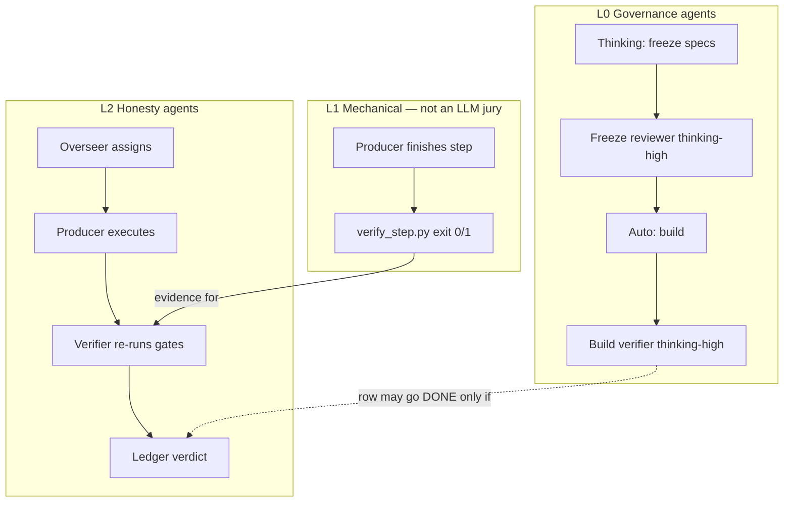
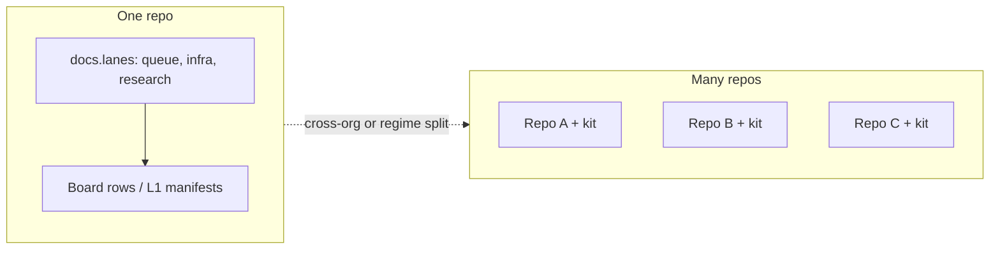
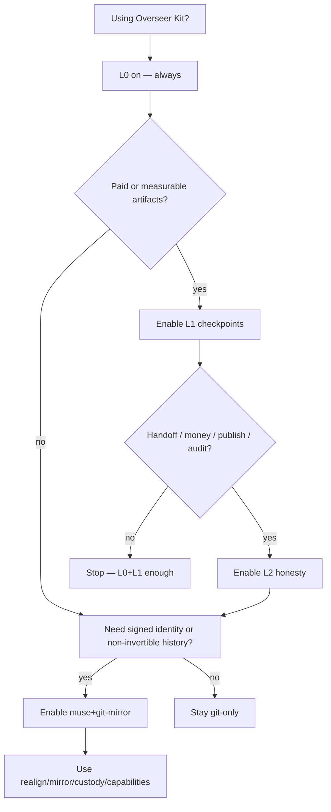

# Overseer Kit — Layered Honesty Architecture Vision

**Status:** Expanded 2026-07-11 · **Architecture vocabulary stable** · K9a contract **frozen** (K9a-r9 → `pass`)  
**Date:** 2026-07-11  
**Audience:** Overseer Kit maintainers, MuseHub collaborators, VideoFactory operators, future open-source adopters  
**Companion (VF dogfood):** VideoFactory PR #34 merged — Option B checkpoints + kit `init --migrate`  
**K9a contract:** `docs/archive/phases/PHASE-K9A-L1-L2-MODULE-FREEZE.md`  
**Consumer pattern:** `docs/CONSUMER-ADAPTER-PATTERN.md`  

> **How to use this doc:** Vision + vocabulary for L0–L3. Normative build contracts live in `PHASE-K9A-*`. K9a freeze review → `pass` (K9a-r9). K9b builds L1 only; K10 builds L2.
---

## 0. Plain-language summary

**Simple version.** Overseer Kit already keeps roadmaps and handovers honest. VideoFactory taught us that is not enough when money and media are on the line: agents mark steps done without proof. We added mechanical checkpoints (scripts that must pass before the next step) and we want a second agent layer (boss / worker / independent checker + a tamper-proof log). MuseHub can sit underneath for signed identity and content-addressed history — optional, never required for baseline kit use. The kit should stay small, modular, and an easy on-ramp from plain GitHub into MuseHub when people are ready.

**Technical version.** This document freezes the *vocabulary* for a layered architecture:

| Layer | Name | Role |
|-------|------|------|
| **L0** | Governance | Roadmap, handover, freeze review, build verification, governance-sync, tiers, model labels |
| **L1** | Domain checkpoints | Manifest + fail-closed verify scripts per work unit (VF Option B pattern) |
| **L2** | Honesty / roles | Overseer · Producer · Verifier + hash-chained ledger + verdict co-requirement (Track H → kit module) |
| **L3** | Substrate | Optional MuseHub (identity, custody, realign/mirror) — deepens, never gates L0–L2 |

**Two legs that complete the product without bloat:**

1. **Domain checkpoint plugin contract** (generalize Option B)  
2. **Optional honesty module** (productize Track H)  
Plus optional **API/CI freeze provider** as a third thin seam (headless review).

---

## 1. Why this exists (problem → insight)

### 1.1 Problems observed

1. **Session amnesia** — new chats reinvent context → L0 handover/roadmap.  
2. **Doc drift** — board says DONE, git says otherwise → L0 governance-sync.  
3. **Spec mush** — Auto builds without freeze → L0 freeze review.  
4. **Self-graded homework** — same agent builds, “verifies,” and writes “Aaron approved” → L2.  
5. **Late failure** — bad narration/avatar/thumb discovered after paid renders → L1 mid-pipeline.  
6. **Model-as-QC for media** — unreliable for A/V integrity → mechanical scripts + human listen.  
7. **Substrate lock-in fear** — tools that require MuseHub won’t be adopted → L3 optional only.

### 1.2 Insight (VideoFactory 2026-07)

SIN gates (what “good” means) + Track H (who may certify) were necessary but **insufficient alone** for remake prevention. By the time a verifier agent “checks,” spend may already be burned. **L1 must run after every step, fail closed, before the next spend.** L2 then protects handoff/register/DONE. L0 keeps the queue honest. L3 is for organizations that need cryptographic custody.

---

## 2. Architecture — all layers

```text
┌──────────────────────────────────────────────────────────────────────────┐
│  L3 SUBSTRATE (optional) — MuseHub                                       │
│  identity · signed ledger · content-addressed commits · realign/mirror   │
└────────────────────────────────┬─────────────────────────────────────────┘
                                 │ deepens (never gates)
┌────────────────────────────────▼─────────────────────────────────────────┐
│  L2 HONESTY MODULE (opt-in) — Track H productized                        │
│  Overseer · Producer · Verifier · verdict ledger · DONE co-requirement   │
└────────────────────────────────┬─────────────────────────────────────────┘
                                 │ requires L1 evidence or equivalent
┌────────────────────────────────▼─────────────────────────────────────────┐
│  L1 DOMAIN CHECKPOINTS (opt-in plugin) — Option B generalized            │
│  manifest.yaml · current_step · vf_verify_* / domain verify_* · PROGRESS │
└────────────────────────────────┬─────────────────────────────────────────┘
                                 │ reports status into
┌────────────────────────────────▼─────────────────────────────────────────┐
│  L0 GOVERNANCE (always on) — Overseer Kit core today                     │
│  roadmap · handover · freeze · build-verify · sync · tiers · labels      │
│  docs.lanes[] (N named pairs) · git-only baseline                        │
└──────────────────────────────────────────────────────────────────────────┘
```

### 2.1 L0 — Governance (shipped)

**What it is:** Portable governance vendored into any repo via `.overseer/config.yaml`.

**Capabilities (current):**

| Capability | Command / asset |
|------------|-----------------|
| Install / sync / status | `overseer init\|sync\|status` |
| Freeze-contract review | `overseer review --freeze` |
| Governance hygiene | `overseer governance-sync [--lane] [--all-lanes]` |
| Model tiers | `policy/model-labels.yaml` — Thinking / Auto / Thinking→Auto / Operator+Auto |
| Freeze reviewer config | `freeze_contract.reviewer.{mode,model,provider,fallback}` |
| Decision tiers | `policy/tiers.yaml` Tier 1/2/3 |
| Multi-lane docs | `docs.lanes` + `default_lane` (**N ≥ 1**, not capped at 2) |
| Cursor rules/skills | freeze-review, build-verification, governance-sync |

**Agents at L0 (governance layers, not org chart):**

| Role | Model hint | When |
|------|------------|------|
| Spec author | Thinking | Outline/Plan, freeze artifact |
| Builder | Auto | Mechanical build against freeze |
| Freeze reviewer | thinking-high | Before Auto depends on spec |
| Build verifier | thinking-high (separate session) | Before roadmap row DONE |

**Provider local vs api:**

| Provider | Meaning |
|----------|---------|
| `local` | Review runs in Cursor / local checklist engine; operator picks model; no API key |
| `api` | Headless path: CLI/CI calls remote model via credentials (e.g. `OVERSEER_REVIEW_API_KEY`); unreachable → `fallback: human`, never fake pass |

### 2.2 L1 — Domain checkpoints (VF Option B → kit plugin)

**What it is:** Per work-unit state machine + fail-closed scripts. Models do not decide pass/fail for measurable artifacts.

**VF instance (shipped in VideoFactory):**

- `docs/video-specs/` — frozen templates per `type_id`  
- `policy/video-checkpoints.yaml` — machine truth  
- `videos/_active/manifest.yaml` + generated `PROGRESS.md`  
- `scripts/verify/vf_verify_step.py` — orchestrator  
- Always-on rule: no step advance without exit 0  

**Generalized kit contract (proposed):**

```yaml
# .overseer/config.yaml (proposed additive)
checkpoints:
  enabled: true
  policy: policy/checkpoints.yaml      # consumer-owned
  active_manifest: videos/_active/manifest.yaml  # or research/_active/...
  orchestrator: scripts/verify/verify_step.py    # or kit-shipped generic
```

**Standard step vocabulary (omit N/A per domain):**  
`brief → … → export → metadata → publish` — domains remap names in policy.

**Hard rules:**

- Only orchestrator sets `verified: true`  
- Board row not DONE until `--all` + L0 `/build-verification-review`  
- No placeholder/temp/draft paths in verified artifacts  

### 2.3 L2 — Honesty / roles (Track H → kit honesty module)

**What it is:** Separation of duties so the worker cannot certify their own work.

| Role | Powers | Forbidden |
|------|--------|-----------|
| **Overseer** | Read all; assign one scoped task; adjudicate disputes; write rulings to ledger | Produce media; self-write verifier verdicts |
| **Producer** | Execute exactly one assignment; write artifacts + reports | Mark DONE; write approvals; write ledger verdicts |
| **Verifier** | Re-execute L1/L0 gates on disk; emit measured verdict bound to SHA | Edit production artifacts; trust producer’s self-report |

**Primitives:**

1. Hash-chained append-only verdict/escalation ledger  
2. Verdict co-requirement before board DONE / handoff / register  
3. CI re-executor (incorruptible remote check)  

**What L2 is not:** A model watching video frames. Verifier re-runs **scripts**; humans still listen for taste.

**VF Track H status:** Spec draft parked; finish with vigor **as kit-optional module**, VF as reference consumer.

### 2.4 L3 — MuseHub substrate (optional deepen)

**Guardrail (frozen K7):** No core governance feature may be MuseHub-only.

| Capability | git-only | muse+git-mirror |
|------------|----------|-----------------|
| L0–L2 baseline | Full | Full |
| Canonical history | GitHub `main` | Muse content-addressed |
| `realign` / `mirror` | No-op | Active |
| Signed human/agent identity | Soft (process) | Hard (keys + capabilities) |
| Ledger custody | File in git | Content-addressed + signed |

---

## 3. Recommendations (priority order)

### 3.1 Do now (operator / short)

1. Keep VideoFactory on L0+L1 dogfood (PR #34 merged).  
2. Run `/freeze-review-loop` once per VF `docs/video-specs/*` template.  
3. Dogfood L1 on next live BOR step before more paid spend.  
4. Enable VF multi-lane only if needed; **queue lane alone is correct** for Option B (per-video = manifest, not second roadmap).

### 3.2 K9a freeze (drafted 2026-07-11 — pending review)

Normative contract: `docs/archive/phases/PHASE-K9A-L1-L2-MODULE-FREEZE.md`

Covers:

- `checkpoints:` config schema (L1 plugin)  
- `honesty:` config schema (L2 module) — roles, ledger path, co-requirement hooks  
- CLI: `overseer verify-step`, `overseer honesty-status`, `overseer ledger`  
- Exit codes `10`–`11` (L1) + `20`–`24` (L2) + seven-tier matrices  
- Explicit non-goals (no media QC models; no Muse-required baseline; no VF domain in core)

**Gate:** freeze review `pass` before K9b Auto — **cleared (K9a-r9).**
### 3.3 Next Auto builds (after K9a pass)

| ID | Deliverable |
|----|-------------|
| K9b | Generic checkpoint orchestrator + policy schema; VF adapter remains reference |
| K10a/b | Honesty module (ledger + roles + co-requirement hooks); VF enables at handoff/register |
| K11 | Real `api` freeze provider + GitHub Action example |
| K12 | Public landing page + LICENSE + scenario gallery (Track N) |

### 3.4 Parallel / later

- Track M — movie/serial continuity (domain; may use L1+L2)  
- Track N — open-source go-to-market / landing / narrative (this doc seeds it)  
- H-6 quality-eval (LLM-as-judge) **only after** L1 pass + golden quarantine set  
- H-7 agent security (injection/SSRF/PII)  
- Muse custody provider behind L2 ledger interface  

### 3.5 Deliberately do not

- Require MuseHub for L0–L2  
- Per-video ROADMAP/HANDOVER (Option B rejected this)  
- Cap lanes at 2 (see §5 — already N-ary)  
- Put model taste in the critical path for measurable artifacts  
- Build a full workflow engine / agent mesh OS  

---

## 4. The “additional layer of agents” and the two legs

### 4.1 Agent layers (how they nest)



**Plain reading:** L0 agents govern *process docs*. L1 scripts govern *artifact honesty mid-flight*. L2 agents govern *who may stamp DONE*. Humans govern *taste and money*.

### 4.2 Two legs (+ thin third seam)

| Leg | Name | Completes |
|-----|------|-----------|
| **Leg A** | Domain checkpoint plugin | Mid-pipeline fail-closed; portable beyond video |
| **Leg B** | Honesty module | End-of-pipeline / register integrity; portable roles+ledger |
| **Seam C** | API/CI provider | Headless freeze & verify in automation |

Together: **small kit, significant tasks.**

---

## 5. Modularity & extensibility

### 5.1 What is already modular

| Extension point | Owner | Notes |
|-----------------|-------|-------|
| `.overseer/config.yaml` | Consumer | Regime, docs paths, freeze reviewer, (future) checkpoints/honesty |
| `docs.lanes` | Consumer | **N named handover/roadmap pairs** — not limited to two |
| `policy/*` | Consumer + kit defaults | Tiers, test tiers, model labels |
| Cursor rules/skills | Kit footprint + consumer adds | Always-on honesty rules stay consumer-owned when domain-specific |
| VCS adapter | Kit | `git-only` · `muse-only` · `muse+git-mirror` |
| Freeze provider Protocol | Kit | `local` \| `api` injectable |
| Domain verify scripts | Consumer | Kit should own orchestrator contract only |

### 5.2 Lanes: more than two?

**Fact:** K8 already supports **arbitrary named lanes** via `docs.lanes` map. Two was an *example* (queue + active), not a hard cap.

**When to add lanes (same repo):**

| Pattern | Example | Use lanes? |
|---------|---------|------------|
| Two concerns, one team | `production` + `engineering` | Yes — 2 lanes |
| Three concerns | `queue` + `infra` + `research` | Yes — 3 lanes |
| Many parallel products | 12 video series boards | **Prefer not** — board rows or separate repos |
| Per-item detail | Each video’s phases | **No** — L1 manifest + PROGRESS.md |

**When to use separate kit instances (separate repos) instead:**

- Different trust boundaries (client work vs internal)  
- Different VCS regimes (one muse-only, one git-only)  
- Different release/legal entities  
- Noise: governance-sync on 15 lanes becomes unreadable  

**Rule of thumb:**

> **Lanes = few durable concerns in one repo.**  
> **Rows / manifests = many instances of the same concern.**  
> **Repos = different orgs, regimes, or products that should not share a baton.**



### 5.3 Proposed module flags (open-ended but typed)

```yaml
# Proposed — not implemented
modules:
  governance: { enabled: true }          # L0 always
  checkpoints: { enabled: false }        # L1
  honesty: { enabled: false }            # L2
  muse_substrate: { enabled: false }     # L3 deepen
  api_review: { enabled: false }         # Seam C

# Escape hatch for future modules without schema churn:
extensions: []   # list of { id, config_path } — kit loads if schemaVersion known; else warn
```

**Open-ended vs specific:** Prefer **typed optional modules** for L1/L2/L3/Seam C, plus a thin `extensions[]` for experiments. Avoid unbounded plugin DLLs in v1.

### 5.4 Domain packs (future stub)

Examples of consumer “packs” that fill L1 policy + scripts:

| Pack | Domain | Checkpoint examples |
|------|--------|---------------------|
| `pack-video` | VideoFactory | narration, avatar, CTA, captions, export |
| `pack-research` | Literature / claims | source cite, quote verify, methods, reproducibility |
| `pack-accounting` | Close / payout | reconcile, dual-control, export hash, approval |
| `pack-scooling` | Education projects | rubric, no-secrets, test tiers, demos |
| `pack-security` | App release | SAST, dependency pin, threat model freeze |

Kit ships **none** of the domain logic required — only the socket.

---

## 6. MuseHub as substrate — invitation to explore

### 6.1 Positioning

Overseer Kit = **easy on-ramp** (GitHub today).  
MuseHub = **deeper honesty substrate** when provenance, identity, and non-invertible history matter.

Same commands; more power when ready. That is a product story and a traffic story.

### 6.2 Who cares (personas)

| Persona | Pain | MuseHub deepen |
|---------|------|----------------|
| Indie AI video studio | Remakes, fake approvals | Signed “human approved” + ledger custody |
| Research lab | Fabricated citations | Content-addressed evidence packs |
| DAO / treasury ops | Disputed payouts | Dual-control + signed approvals |
| Classroom (Scooling) | Students skip tests | Portable integrity curriculum + optional Muse identity |
| Agency with clients | “Which version shipped?” | Mirror export + provenance UI |
| Regulated org | Audit trail | Append-only ledger on Muse + capability scopes |

### 6.3 Scenario A — Video studio (VideoFactory-shaped)

```mermaid
sequenceDiagram
  participant Hum as Human
  participant Prod as Producer Auto
  participant L1 as L1 verify scripts
  participant Ver as Verifier
  participant Board as Status board
  participant Muse as MuseHub optional

  Hum->>Board: Prioritize BOR-60
  Prod->>L1: Finish narration step
  L1-->>Prod: exit 0 / fail
  Prod->>L1: … export step
  L1-->>Ver: artifacts + reports
  Ver->>Ver: Re-run gates; SHA bind
  Ver->>Board: Ledger verdict pass
  Hum->>Board: Listen approve
  opt L3 on
    Board->>Muse: Custody pin + signed approval
  end
```

**Without Muse:** L0+L1+L2 still work on git-only.  
**With Muse:** Approvals and verdicts are keyed identities; history resists silent rewrite.

### 6.4 Scenario B — Research paper pipeline

| Step | L1 check | L2 |
|------|----------|-----|
| Sources | Every claim has URL + retrieved hash | Verifier re-fetches sample |
| Quotes | Quote text ⊆ source span | Independent session confirms |
| Stats | Script regenerates tables from CSV | Verdict on output SHA |
| Submit | PDF hash locked | Human + verifier co-sign |

**MuseHub angle:** Evidence pack as content-addressed tree; peer review sees immutable snapshot.

### 6.5 Scenario C — Accounting close

| Step | Mechanical | Honesty |
|------|------------|---------|
| Import bank CSV | Schema + checksum | |
| Reconcile | Diff ≤ threshold | Dual Producer roles (prep vs review) |
| Payout list | Hash of CSV | Verifier + human Tier-3 |
| Export | SHA sentinel | Ledger + optional Muse custody |

**MuseHub angle:** Capability `transfer:propose` vs `transfer:execute`; kit honesty maps to Muse capabilities.

### 6.6 Scenario D — Scooling / classroom

Student repo vendors kit:

1. L0 forces freeze → Auto → build-verification  
2. L1 optional “assignment checkpoints” (tests green, no secrets)  
3. L2 optional “TA verifier” session  
4. L3 optional — student Muse identity for portfolio provenance  

**Traffic story:** Teacher installs kit on GitHub; lesson 4 offers “upgrade history to MuseHub.”

### 6.7 Scenario E — Multi-org open source

```text
Maintainer repo (git-only L0)
    ↓ contributor PRs
CI: freeze review api provider + L1 tests
    ↓ merge
Optional: mirror to Muse for provenance badge on landing page
```

### 6.8 Flowchart — when to turn L3 on



### 6.9 Open questions for MuseHub collaborators

1. Minimal Muse objects for an Overseer verdict?  
2. Map kit Tier-3 to Muse capabilities 1:1?  
3. Landing-page “provenance badge” from mirror?  
4. Classroom provisioning UX without scaring GitHub-only users?  
5. Can `CustodyLedgerProvider` in VF Track H be the same interface as kit L2?

---

## 7. Track map (kit + VF + proposed)

| Track | Home | Intent | Status |
|-------|------|--------|--------|
| **K1–K8** | Overseer Kit | Core governance + multi-lane | DONE |
| **K9a** | Overseer Kit | Freeze L1+L2 module contracts | Drafted — pending freeze review |
| **K9b** | Overseer Kit | Build L1 checkpoint orchestrator | Blocked on K9a `pass` |
| **K10** | Overseer Kit | L2 honesty module (Track H productized) | TODO after K9a |
| **K11** | Overseer Kit | API/CI freeze provider | TODO |
| **K12 / Track N** | Overseer Kit | Open-source landing, narrative, scenario gallery | Seeded in §8; build later |
| **Track H** | VideoFactory (→ kit) | Honest factory org chart + ledger | Spec draft; park→port |
| **Track M** | VideoFactory / Muse plugin | Movie/serial continuity, timeline domain | Prepared / Muse VID-* |
| **FACTORY-WIRE** | VideoFactory | Invocation wiring | DONE |
| **Option B** | VideoFactory | L1 dogfood | Merged PR #34 |

### 7.1 Track M (brief)

Long-form narrative continuity (series bible, cast registry, timeline). Uses L0 for phases; should use L1 for continuity checkpoints; L2 before “season publish.” Muse `video-timeline` plugin is a substrate candidate — **non-blocking** for kit K9–K12.

### 7.2 Track N (proposed) — Narrative & open-source presence

**Purpose:** Make the kit understandable and adoptable.

Deliverables (draft):

- Public landing page (see §8)  
- Scenario gallery (A–E above as comics/diagrams)  
- “GitHub today → MuseHub when ready” funnel copy  
- LICENSE clarity + security disclosure  
- One-click consumer init story  

Track N is **marketing + clarity**, not a second architecture. It consumes this vision doc.

---

## 8. Open-source landing page — outline (for Track N)

### 8.1 Hero

- **Name:** Overseer Kit  
- **Promise:** Phased AI work without amnesia, fake DONE, or silent drift — on plain GitHub.  
- **Subpromise:** Optional MuseHub depth when you need provenance.  
- **CTA:** `overseer init` · Star · Docs  

### 8.2 Sections

1. **Problem** — agents forget, self-approve, skip tests  
2. **L0 in 60 seconds** — roadmap + handover animation  
3. **Add L1** — mechanical checkpoints (video + research examples)  
4. **Add L2** — boss / worker / checker  
5. **Optional L3** — MuseHub substrate  
6. **Modularity** — lanes, modules, domain packs  
7. **Who it’s for** — studios, labs, classrooms, treasuries  
8. **Quickstart** — git-only in 5 minutes  
9. **MuseHub upgrade path** — same CLI, deeper history  
10. **Roadmap** — K9–K12 public  

### 8.3 Graphics to commission / generate

| Graphic | Content |
|---------|---------|
| Layer cake | L0–L3 diagram |
| Sequence | Scenario A video studio |
| Funnel | GitHub → Kit → MuseHub |
| Org chart | Overseer / Producer / Verifier |
| Lane map | N lanes vs rows vs repos |

### 8.4 Tone

Not “another agent framework.” **Governance + honesty for people who already use Cursor/GitHub.** MuseHub appears as optional power, not homework.

---

## 9. Completeness checklist — modularity “DONE enough?”

| Question | Answer |
|----------|--------|
| Extensible docs pairs? | **Yes** — `docs.lanes` is N-ary (K8) |
| Extensible VCS? | **Yes** — adapter regimes |
| Extensible review provider? | **Yes** — Protocol local/api |
| Extensible domain checks? | **Partial** — VF has it; kit needs K9 contract |
| Extensible honesty? | **Partial** — VF Track H spec; kit needs K10 |
| Extensible substrate? | **Yes** — Muse optional deepen |
| Escape hatch for unknown modules? | **Propose** `extensions[]` in K9a |
| Risk of over-modularity? | High if plugin marketplace early — avoid until 2+ domain packs dogfood |

**Verdict:** Core L0 modularity is DONE enough. Completing the product means **typed L1+L2 modules + landing (Track N)**, not infinite plugins.

---

## 10. Risks & mitigations

| Risk | Mitigation |
|------|------------|
| Kit becomes VF-specific | Domain packs stay out of kit core; VF is reference only |
| L2 without L1 | Allow but warn — certification without mid-pipeline checks repeats remakes |
| Muse-only feature creep | K7 guardrail; CI tests git-only path |
| Too many lanes | Docs guidance: prefer rows; soft warn >4 lanes |
| API provider secrets in repo | Env only; fail-closed; never stamp pass on unreachable |
| Landing overclaims | Scenario gallery labeled dogfood vs aspirational |

---

## 11. Expansion results (2026-07-11 Thinking) — challenges + decisions

### 11.1 Challenges to the draft (and resolutions)

| Challenge | Resolution frozen in K9a |
|-----------|--------------------------|
| Is L2 useless without L1? | Allowed with **warn** (`require_l1_evidence: warn\|require`); remake risk documented |
| Are “two legs” enough? | Yes + thin Seam C (K11). No agent-mesh OS |
| Does Track H *is* the plan? | **No** — Track H is L2 source material for K10; kit master plan is L0→L3 |
| Cap lanes at 2? | **No** — K8 is N-ary; soft warn >4 |
| VF files in kit `docs/` root? | **Hygiene:** move to `docs/consumers/videofactory/`; kit-neutral root |
| Muse objects before Muse collab? | File ledger first; Muse blob = same bytes; capability 1:1 map deferred |
| Missing domains? | Added pack stubs already (§5.4); no new layer required |
| Exit codes vs VF SIN 60–64? | Kit uses `10`–`11` (L1) and `20`–`24` (L2); VF maps at boundary |

### 11.2 Deliverables completed this expansion

1. Redlines → §11.1 + K9a §K9.0–§K9.1  
2. K9a contract → `docs/archive/phases/PHASE-K9A-L1-L2-MODULE-FREEZE.md`  
3. MuseHub answers → K9a §K9.14 (open: exact Muse schema types)  
4. Track N wireframe → vision §8 + K9a §K9.13  
5. Non-goals → K9a §K9.0  
6. ROADMAP + HANDOVER → NEXT = K9a freeze review → K9b  

### 11.3 Still required before Auto

- Independent `overseer review --freeze` on the K9a contract → `pass`  
- Owner acknowledgment of non-goals (no Muse-required baseline; no media QC authority)

---

## 12. Copy-paste prompt — next session (freeze review → K9b)

```text
Project: Overseer Kit — K9a freeze review, then K9b only if pass.
Model: Thinking (high) for review; Auto for K9b after pass.
Read: docs/archive/phases/PHASE-K9A-L1-L2-MODULE-FREEZE.md;
  docs/archive/thinking/OVERSEER-KIT-LAYERED-HONESTY-VISION.md;
  docs/OVERSEER-KIT-SPEC.md; docs/ROADMAP.md; docs/OVERSEER-HANDOVER.md;
  docs/CONSUMER-ADAPTER-PATTERN.md.

Tasks:
1) Run overseer review --freeze on PHASE-K9A-L1-L2-MODULE-FREEZE.md
2) Resolve any findings; re-review until pass
3) Only after pass: Auto K9b = L1 orchestrator only (not L2)
4) Update ROADMAP + HANDOVER together

Hard stops: no L2 build in K9b; no VF domain scripts in kit core;
  no Muse-required baseline; no media model QC as authority.
```

---

## 13. Change log

| Date | Note |
|------|------|
| 2026-07-11 | Initial vision from VF Option B + kit init dogfood + Track H reposition + Muse on-ramp brainstorm |
| 2026-07-11 | Expansion: challenged L0–L3; drafted K9a contract; consumer doc hygiene; Muse §6.9 answers; Track N seed confirmed |

---

## Appendix A — Glossary

| Term | Meaning |
|------|---------|
| Option B | VF pattern: manifest + verify + PROGRESS (no per-video ROADMAP) |
| Track H | VF honest-factory roles + ledger (candidate kit L2) |
| Track M | Movie/serial continuity / timeline |
| Track N | Open-source narrative + landing |
| Lane | Named handover+roadmap pair in one repo |
| Verdict | L2 measured pass/fail bound to artifact SHA |
| Headless freeze | `provider: api` review without Cursor UI |

## Appendix B — Reference paths

| Path | Role |
|------|------|
| `docs/OVERSEER-KIT-SPEC.md` | Frozen kit architecture |
| `docs/archive/phases/PHASE-K8-MULTI-LANE-DOCS-CONTRACT.md` | N-lane docs |
| `docs/archive/phases/PHASE-K9A-L1-L2-MODULE-FREEZE.md` | K9a normative contract |
| `docs/CONSUMER-ADAPTER-PATTERN.md` | How consumers plug in |
| `docs/archive/consumers/videofactory/CHECKPOINT-BUILD-PROMPT.md` | L1 VF build prompt (reference) |
| `docs/consumers/videofactory/OVERSEER-SETUP.md` | VF consumer setup (reference) |
| VideoFactory `policy/video-checkpoints.yaml` | L1 machine truth (dogfood) |
| VideoFactory `docs/thinking/VF-OVERSEER-HONEST-FACTORY-SPEC-20260709.md` | L2 draft (Track H) |

## Appendix C — Power thesis (one paragraph)

A small governance kit becomes powerful when it sits at the **decision boundaries** of work: what is next (L0), what may proceed mid-flight (L1), who may certify (L2), and optionally where truth is stored (L3). Most “agent platforms” try to run everything; Overseer Kit only makes **skipping honesty expensive**. That is useful to studios, labs, classrooms, and treasuries — and MuseHub is the natural deepen for anyone who outgrows “trust the markdown file.”
