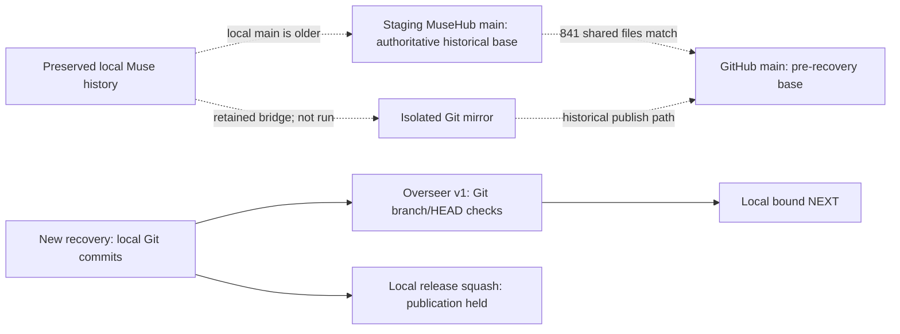
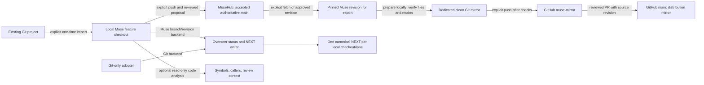

# V1 recovery milestone — verification, 2026-10-08

**Current disposition after owner correction: intended MuseHub-first v1 is
incomplete; the Git-only release is on hold.** The earlier Git-based validation
remains valid within its tested scope. The [restoration audit below](#musehub-restoration-audit--2026-10-08)
supersedes the prior publication recommendation and records actual Muse evidence.
Earlier milestone text is preserved as history, not a present release claim.

**Result: bounded v1 local validation is complete and 1.0.0 release preparation is
in progress.** The explicitly authorized
DINERO manual pilot passed in session 4; clean installation/rollback, architecture
review and corrected build findings remain closed. No release or broader rollout
was performed. Session 1 reached the session-2 status/NEXT checkpoint
across two disposable repositories. Session 2 independently reviewed the bounded
architecture and completed recovery build; see the review below. The original
implementation evidence is retained in the preceding milestone sections.

## Preservation and base

Original physical checkout and Git root:
`/Users/operator/OVERSEER_KIT/overseer-kit`; repository name `overseer-kit`;
branch `feat/overseer-context-isolation`; HEAD
`e9be0c4b3cafb149b9f3b7af2ab060f01bbfa504`.

Verified local snapshot:
`/Users/operator/OVERSEER_KIT/RECOVERY-SNAPSHOTS/20261008T122430Z-v1-recovery`.
The archive contains 21,213 entries: complete checkout including .git/.muse/venv,
all untracked/ignored payload, operator-owned workspace file, recovery handover,
prior OCI snapshot, and NXR/GSR evidence. Separate all-ref Git bundle (153 refs),
full-index binary staged/unstaged patches, untracked archive, inventory with type,
mode, size, SHA-256, uid/gid/mtime and symlink targets, plus artifact SHA256SUMS.
Archive and untracked archive were reopened and compared; bundle verification,
reopened bare clone and `git fsck --full` passed (two dangling historical commits,
no corruption). All artifact hashes were rechecked after implementation.

All 19,418 original archived regular files rechecked byte-identical with matching
modes; symlink targets matched. An IDE `vscode-merge-base` entry appeared for the
new feature branch in shared Git config; it was removed and exact original bytes
restored. New Git worktree administration and feature refs are intentional
additions. No original payload or historical evidence was deleted. This snapshot
is local and is not an off-device backup.

Implementation worktree:
`/Users/operator/OVERSEER_KIT/overseer-kit-v1-recovery`; branch
`feat/overseer-v1-recovery`; base `d47291d5d9030de5ebef713da95efa978c4d8c6e`.
The [scope decision](../decisions/V1-SCOPE-RESET.md) records the exact local Muse
reconciliation: 835 identical files, six explained repair differences and five
omitted generated/local files. No remote reconciliation or Muse ref mutation.

## Clean-base results before implementation

Python 3.14.4, pytest 9.1.1; base tests used the preexisting development venv, with
bytecode and pytest cache writes disabled. Tests ran in the new untouched feature
worktree before source changes.

| Run | Result | Time |
| --- | --- | --- |
| Full original suite | 1,391 passed, 104 failed | 27.40s |
| Excluding hosted_dashboard, q1_app, q4b_ui, q3_desktop groups | 1,313 passed, 44 failed, 138 deselected | 24.77s |

Full-suite failures: 68 socket bind/listen denials imposed by the sandbox; 16
launcher missing-PyYAML failures; 9 missing paths/fixtures; 11 other product/test
failures. The filtered run still included eight socket denials in LAC tests.
These are classifications of actual tracebacks, not blanket attribution to the
sandbox. [All 104 failing node IDs](baseline-failures.json) retain their categories
and error messages. The former product has unresolved failures; it is not claimed
green. The v1 launcher/environment and canonical documents replace the retained
behavior; deferred desktop/hosted/orchestration/review/publishing defects remain
historical and unresolved.

Exact baseline commands (PY is the original checkout's `.venv/bin/python`):

```sh
PYTHONDONTWRITEBYTECODE=1 "$PY" -m pytest -q -p no:cacheprovider --junitxml=/private/tmp/overseer-v1-baseline.xml
PYTHONDONTWRITEBYTECODE=1 "$PY" -m pytest -q -p no:cacheprovider -k 'not hosted_dashboard and not q1_app and not q4b_ui and not q3_desktop' --junitxml=/private/tmp/overseer-v1-baseline-filtered.xml
```

## Supported v1 release matrix

Default pytest collection is `tests/v1` plus `tests/retained`. This follows the
retained requirements, not the result of individual old tests. Every original
test source remains byte-identical at its old path, labeled historical in
`tests/README.md` and inventoried in `tests/historical/baseline-test-inventory.json`.
A supported integrity test verifies that preservation. Dirty OCI/NXH tests remain
in the original checkout and snapshot; none were ported. `cli/legacy_main.py`
preserves the former CLI. It is outside the public v1 command surface.

| Retained requirement | Supported coverage |
| --- | --- |
| Status, init, sync; persistent UUID; living-document preservation | `tests/v1/test_commands.py` (real disposable Git repositories and worktrees) |
| Canonical read-only NEXT; strict metadata; expected repository/branch/lane/model/action ID/kind; stale state | `test_commands.py` (including malformed, copied, duplicate, missing, tampered, unborn, detached, and post-commit cases) |
| Two similar repositories with identical action IDs | `test_isolation.py` (14 matrix tests) |
| Cwd, explicit -C, copied config/NEXT, bound launchers and hooks | `test_isolation.py`, both fixture directions |
| PATH/PYTHONPATH/PYTHONHOME/Git environment poisoning; no neighboring runtime fallback; normal venv symlinks | `test_isolation.py`, `test_commands.py` |
| Confined no-follow reads/writes, hardlink refusal, raw digest, atomic replacement and fsync failures | `test_integrity.py` |
| Concurrent stale writers and readers; bounded reads | `test_integrity.py` (stress and performance coverage) |
| Retained digest module | Six unchanged tests in `tests/retained/test_footprint_digest.py`, plus v1 raw-byte digest regression |

No test skip or expected-failure marker masks a supported requirement. The retained
atomic-write and repository-scope behavior has direct executable regression
coverage rather than the old stale fixture assumptions. No socket service,
consumer repository, push, mirror, merge, release, deployment, or pilot is needed.

## Implementation results

The worktree uses its own conventional Python 3.14.4 venv with standard Python
symlinks. Dependencies were seeded offline from already installed package bytes,
excluding the original editable-package finder and `.pth`; imports resolve to
this checkout and this venv. Runtime requirements are pinned in
`requirements-v1.txt`, development requirements in `requirements-v1-dev.txt`.
Fresh network installation and current/previous rollback are future milestones.

| Run | Result | Time |
| --- | --- | --- |
| Initial v1 regression run | 56 passed, 2 failed | 41.57s |
| Focused command/write tests after correction | 45 passed | 25.72s |
| Two-repository isolation matrix | 14 passed | 22.72s |
| Complete supported suite, including later added boundary tests | **77 passed, 0 failed** | **45.27s** |

The two initial failures exposed sync accepting symlinked docs/NEXT paths. Sync
now refuses those paths before refreshing assets. Additional full-suite coverage
checks relative launchers, malformed hook events/config, dry-run recovery of a
missing launcher, linked Git worktrees, first commits, post-publication fsync
errors, and preservation of old tests.

Commands in the recovery worktree:

```sh
.venv/bin/python -m pytest -q tests/v1/test_commands.py tests/v1/test_integrity.py -p no:cacheprovider
.venv/bin/python -m pytest -q tests/v1/test_isolation.py -p no:cacheprovider
.venv/bin/python -m pytest -q -p no:cacheprovider
./cli/ok -C . status --json
./cli/ok -C . next
```

Own-checkout status and NEXT passed. The original config is preserved verbatim at
`docs/archive/v1/config-before-reset.yaml`; this worktree was explicitly bound once
to UUID `6dba88a5-029c-4136-9277-c3a0c81f31a6`. Its read-only hooks were refreshed;
no real consumer hook was activated. `git diff --check` passed.

Machine counts: [test-results.json](test-results.json). Full logs, JUnit files,
Muse comparison, preservation recheck, and SHA256SUMS are stored at
`/Users/operator/OVERSEER_KIT/RECOVERY-RUNS/20261008-v1-session-1`.

## Limits and next action

Supported: POSIX Git checkouts/worktrees, one lane and configured model per
checkout, source installation with its own venv. Muse-only command integration,
automatic config migration/rebinding, packaged installation and rollback remain
out of this milestone. Scope is a trusted local host, not malicious same-UID/root.
Sync is per-file atomic and rerunnable; it has no transaction/recovery subsystem.
Directory fsync failure after replacement reports failure even though a complete
new NEXT may already be present; readers never see a partially written file.

The implementation run had no unresolved supported-suite failures. The independent
review below identified two additional defects outside that coverage; both are
closed by the correction/recheck recorded at the end of this document. Final v1
was incomplete at that point. Installation/rollback closed in session 3 and the
authorized consumer pilot closed in session 4 below. The current action in
`docs/NEXT.md` is **OVERSEER-V1-COMPLETE**, kind `stop`; no recovery task is queued.

## Independent architecture and completed-build review — session 2, 2026-10-08

Reviewer: fresh GPT-6 Astra review session, action `OVERSEER-V1-REVIEW-1`, lane
`product`. Physical cwd and Git root both resolved to
`/Users/operator/OVERSEER_KIT/overseer-kit-v1-recovery`; branch
`feat/overseer-v1-recovery`; full HEAD
`2bfa69864ec2f8bb3d89cc66d6353dd111421875`. Config name `overseer-kit`, UUID
`6dba88a5-029c-4136-9277-c3a0c81f31a6`. The checkout was clean before review.
Reviewed the 48-file change from `d47291d5d9030de5ebef713da95efa978c4d8c6e`.

**Architecture verdict: pass for the bounded trusted-host design.** Explicit
physical-root/UUID binding, canonical NEXT, isolated source/venv launchers,
expected-context checks, raw-byte compare-before-write, and directory-locked
atomic NEXT replacement fit the scope. Per-file sync and the documented
post-replacement fsync limitation do not require a transaction or security
subsystem. Historical commands are excluded from the v1 entrypoint. No discarded
OCI/GSR/sole-writer prerequisites are needed to address the findings.

**Completed-build verdict: findings; pass withheld.** Both findings below were
reproduced against the reviewed HEAD using two fresh disposable Git repositories
under `/private/tmp`, removed by `TemporaryDirectory` after the probes. No
production code or permanent tests were changed for this review.

1. **P2 — Reject abbreviated duplicate repository selectors.**
   `cli/v1.py:332`, `345`, and `373–376`: argparse accepts unique long-option
   abbreviations, but the duplicate-binding scan recognizes only full spellings.
   With initialized fixtures A and B, `cli/ok -C A --repo B next` exits 2 with
   `duplicate_binding_option`; `cli/ok -C A --rep B next` instead exits 0 and prints
   B's repository and prompt. A conflicting explicit selection therefore silently
   wins, contrary to the duplicate-selector guard and strict repository contract.
   Disable abbreviation on both the root parser and subparsers, or normalize all
   accepted aliases before duplicate detection. Validate refusal with no prompt
   for abbreviated duplicates as well as the existing full-spelling cases.

2. **P2 — Include executable permissions in sync's asset comparison.**
   `cli/v1.py:278–289`: `apply_assets` schedules replacement only when bytes differ.
   After fixture initialization with hooks, changing `.overseer/bin/ok` and
   `.cursor/hooks/session-start-next.sh` to mode 0644 without changing their bytes
   leaves both unusable. Both `sync --hooks --dry-run --json` and
   `sync --hooks --json` exit 0 with `changed: []`; both files remain 0644 and
   non-executable. Compare required modes as well as content, report mode repairs
   in dry-run, and restore the executable mode during sync. Validate invocation
   of the repaired launcher and hook, plus dry-run non-mutation.

Verification: the exact requested `.venv/bin/python -m pytest -q` completed with
**77 passed, 0 failed, 0 skipped in 51.99s**. These two additional defect probes
are not included in that count; both findings remain unresolved. Own-checkout
`cli/ok -C . status --json` and `cli/ok -C . next` passed. The historical inventory
was compared to the base revision, and the legacy CLI and retained digest tests
were confirmed byte-identical to their base sources. Prior archive/Muse evidence
was read as recorded evidence, not independently re-created or remotely verified.

Disposition: correct the two cited defects within this bounded implementation and
recheck them before granting the completed-build pass. After that pass, the next
engineering milestone is clean installation/current-previous rollback, within the
five-to-eight-session cap. The independently accepted architecture needs no new
packet chain. The existing review NEXT remains unchanged and validates from disk;
this review did not publish a new action or make a local commit. ROADMAP and
HANDOVER were updated together. No real consumer, push, mirror, merge, release,
deployment, consumer hook activation, or pilot was used.

### Same-action recheck — 2026-10-08

The owner repeated `OVERSEER-V1-REVIEW-1` in the same review conversation.
Reconfirmed the physical root, branch, full HEAD, config name and UUID recorded
above, and reread the scope and review evidence. The diff from the recovery base
still contains the same implementation; compared with the reviewed HEAD, only
the three review documents are modified. This is a continuation of session 2,
not another independent reviewer or completed milestone.

Reran the exact `.venv/bin/python -m pytest -q`: **77 passed, 0 failed, 0 skipped
in 54.26s**. Both P2 findings reproduced again in fresh disposable fixtures:
`-C A --rep B next` printed B while the full-spelling duplicate was refused;
dry-run and actual sync reported `changed: []` with the launcher and start hook
still non-executable at 0644. The probe fixtures were removed. Status and NEXT
validated, and `git diff --check` passed. Architecture verdict remains pass;
completed-build verdict remains findings with both defects unresolved. The
conditional installation/rollback milestone has not been started. No production
code, permanent tests, NEXT, or Git refs changed during this recheck.

### Additional independent verification of the same action — 2026-10-08

Reconfirmed physical cwd/Git root, branch, full HEAD, config name and UUID against
the identity recorded above. This invocation began with existing uncommitted
changes in this validation document, ROADMAP, and HANDOVER; those changes were
preserved. Implementation HEAD remains `2bfa69864ec2f8bb3d89cc66d6353dd111421875`.
Reviewed the 48-file diff from `d47291d5d9030de5ebef713da95efa978c4d8c6e`, including
the command/parser and confined I/O implementation, launchers/hooks, supported
tests, scope changes, and historical preservation. This continues the existing
review action; it does not advance the milestone/session budget.

The exact `.venv/bin/python -m pytest -q` passed: **77 passed, 0 failed,
0 skipped in 55.97s**. Independently repeated both finding probes in two fresh
Git fixtures under `/private/tmp`, removed on completion:

- Full-spelling `-C A --repo B next` exited 2 with `duplicate_binding_option` and
  no foreign prompt; `-C A --rep B next` exited 0 and printed B's repository and
  prompt. Finding 1 remains unresolved (`cli/v1.py:332–345`, `373–376`).
- After changing the initialized launcher and start hook to 0644, both
  `sync --hooks --dry-run --json` and `sync --hooks --json` exited 0 with
  `changed: []`. Both assets remained 0644 and failed the executable-access check.
  Finding 2 remains unresolved (`cli/v1.py:278–289`).

Compared all 324 inventoried historical test files with the base revision and
confirmed the inventory hashes. The preserved legacy CLI, retained digest tests,
and archived pre-reset config also match their base sources byte-for-byte.
Archive/Muse preservation claims remain previously recorded evidence, not a new
archive or remote verification. Own-checkout status and canonical NEXT validated;
`git diff --check` passed.

**Disposition unchanged: architecture pass; completed-build pass withheld for
the two P2 findings.** Correct and recheck them before clean installation/current-
previous rollback, keeping the five-to-eight-session cap. Updated both living
summaries; no production code, permanent tests, canonical NEXT, or Git refs were
changed. No new packets, discarded security machinery, real consumers, push,
mirror, merge, release, deployment, consumer hook activation, or pilot was used.


### Findings corrected; repeated review action closed — 2026-10-08

The owner explicitly asked to get out of the repeated-prompt loop. The cause was
handoff handling: the review had completed with actionable findings, but canonical
NEXT still requested the same review. Repeating the suite against unchanged code
could not resolve either finding. The reviewer corrected the two cited defects
and rechecked the original acceptance criteria here. This is same-session finding
closure within session 2, not a claim of another independent review or final-v1
completion. Earlier review observations above are retained as historical evidence.

Starting identity: physical cwd/Git root
`/Users/operator/OVERSEER_KIT/overseer-kit-v1-recovery`, branch
`feat/overseer-v1-recovery`, HEAD `2bfa69864ec2f8bb3d89cc66d6353dd111421875`,
config name `overseer-kit`, UUID `6dba88a5-029c-4136-9277-c3a0c81f31a6`.

- Finding 1 closed: `cli/v1.py` disables argparse abbreviation on the root parser
  and every subparser. Abbreviated conflicting selectors before/after the command,
  including equals forms, now exit 2 without a prompt in both fixture directions.
  Full-spelling duplicates still refuse; valid full-spelling selection still works.
- Finding 2 closed: asset planning compares required file modes as well as bytes
  and carries the planned mode into the existing atomic replacement. Dry-run lists
  all three damaged executable assets without changing bytes or modes. Actual sync
  restores the launcher and both hooks to 0755, preserves their bytes and living
  documents, and each repaired executable successfully reads NEXT. Repeated sync
  reports no changes.

Verification: **22 disposable verification cases passed**, using two fresh Git
repositories in a `TemporaryDirectory` under `/private/tmp`; fixtures were removed.
No permanent tests were added. The exact `.venv/bin/python -m pytest -q` then
reported **77 passed, 0 failed, 0 skipped in 54.44s**. The counts are separate;
the 22 cases are targeted script checks, not additional collected pytest tests.
Own-checkout explicit sync refreshed only the runtime digest in config after the
source edit; repository identity stayed unchanged. Status, NEXT and whitespace
checks passed. Existing review evidence was preserved in the validation record.

**Disposition: bounded architecture pass retained; completed-build review closed
with its two findings corrected and rechecked.** No unresolved supported-suite
failure or open finding remains from this review. Clean installation/current-
previous rollback is the next engineering milestone, not another identical review.
Canonical NEXT is published through `next-write` with explicit context and the
prior raw digest as **OVERSEER-V1-INSTALL-ROLLBACK-1**, kind `implement`. ROADMAP
and HANDOVER now summarize this disposition. The five-to-eight-session cap remains;
installation/rollback and the separately authorized consumer pilot are outstanding.
No new packet, security subsystem, real consumer, push, mirror, merge, release,
deployment, consumer hook activation, or pilot was introduced.

## Clean source installation and rollback — session 3, 2026-10-08

Action `OVERSEER-V1-INSTALL-ROLLBACK-1`, lane `product`, model `GPT-6 Astra`.
Physical cwd/Git root: `/Users/operator/OVERSEER_KIT/overseer-kit-v1-recovery`;
branch `feat/overseer-v1-recovery`; starting clean HEAD
`b2a09775d1daabd0b49003b36b18cfce31434fb5`; config name `overseer-kit`, UUID
`6dba88a5-029c-4136-9277-c3a0c81f31a6`. Initial own-checkout `./cli/ok -C .
status --json` and `./cli/ok -C . next` passed. No production code or permanent
test changed; the closed architecture/build review was not repeated.

**Passed: two clean dependency installations, six fixture lifecycle stages, and
77 supported tests (0 failed, 0 skipped) in 54.46s.** The lifecycle stages are
script assertions, not six additional pytest tests. Each independent runtime
followed previous → current → previous at its original physical path:

| Source | Git revision | Runtime SHA-256 |
| --- | --- | --- |
| Previous / rollback | `2bfa69864ec2f8bb3d89cc66d6353dd111421875` | `f85810afb27de05cff194a01f8b229ea23d9a9b82b5d7613d1d4bd7647133066` |
| Current | `b2a09775d1daabd0b49003b36b18cfce31434fb5` | `045412b50c755e188a37aff017924a1eaf6b21fe57f1b14407e74eb026630bc8` |

Both report version `1.0.0.dev1`; the source digest distinguishes them. Sources
were exported using `git archive`, without copying the recovery venv. Installations
`runtime a` and `runtime b` and Git repositories `fixture a` and `fixture b` lived
under `/private/tmp/overseer-v1-install-2jo3ue_u` (paths intentionally contain
spaces). Each runtime had its own new conventional `.venv`; neither PyYAML nor
pytest was importable before installation. Python was 3.14.4 on Darwin arm64.

The first pip attempt exited 1 because sandbox DNS could not resolve PyPI. The
same installation command passed with approved network access for both venvs,
using `--isolated --no-cache-dir --index-url https://pypi.org/simple`. No installed
package bytes or pip cache were used to seed them. Both `pip check` runs reported
no broken requirements, and isolated imports resolved within the respective
venv. Both freezes: PyYAML 6.0.3, pytest 9.1.1, iniconfig 2.3.1, packaging 26.3,
pluggy 1.6.0, Pygments 2.21.0. The two revisions have identical runtime and dev
requirements; the clean environments remained in place throughout the exercise.

Every lifecycle stage validated direct and bound-launcher status/NEXT, with
explicit expected UUID, branch, lane, model, action ID/kind and NEXT digest.
Both fixtures used `FIXTURE-INSTALL-1` with distinct prompts and identities:
`875f5b76-5978-4ba1-a8be-11235fb07cf0` (A) and
`f315a1dd-454b-46d0-af75-ad745b2054a7` (B). Before each sync, both entrypoints
refused status/NEXT with exit 2 and `runtime_changed`. Dry-run listed only
`.overseer/config.yaml` and changed no fixture bytes/modes. Explicit sync updated
that pin; repeated sync reported `changed: []`. Cross-installation sync refused
with `runtime_installation_mismatch` and made no changes in all six stages.

Assertions preserved the UUID/name/root, Git branch and HEAD, NEXT bytes/digest,
preexisting ROADMAP/HANDOVER, prompt and binary payload bytes/modes, bound launcher
bytes/mode, and original venv configuration. After rollback, every fixture file
outside `.git`, including config, matched its original post-init/publication hash
and mode. No fixture hooks were installed by the lifecycle script; the supported
suite exercises its own disposable hooks. Both installation directories and both
Git fixtures were removed after success.

### Exact commands and retained evidence

All orchestration commands below were invoked from the recovery worktree. The
preserved script contains the assertions, and `commands.jsonl` records every
expanded argv, cwd, expected/actual exit, stdout and stderr, including the initial
DNS failure. `results.json` contains all six status records; `supported.xml` is
the JUnit report; `cleanup.txt` records removal. Evidence directory:
`/Users/operator/OVERSEER_KIT/RECOVERY-RUNS/20261008-v1-session-3`.

```sh
.venv/bin/python /Users/operator/OVERSEER_KIT/RECOVERY-RUNS/20261008-v1-session-3/validate.py prepare
.venv/bin/python /Users/operator/OVERSEER_KIT/RECOVERY-RUNS/20261008-v1-session-3/validate.py install
# Same install command retried with network access after sandbox DNS failure.
.venv/bin/python /Users/operator/OVERSEER_KIT/RECOVERY-RUNS/20261008-v1-session-3/validate.py probe
```

The script exports each revision with `git archive --format=tar -o ARCHIVE REV`
and uses Python `tarfile.extractall(runtime, filter='data')` to replace the local
trusted source at the fixed installation path, leaving its venv in place. Both
revisions have the same tracked file set. For each runtime it invokes (variables
below stand for the corresponding exact paths/UUID/digest in `commands.jsonl`):

```sh
/opt/homebrew/Cellar/python@3.14/3.14.4_1/Frameworks/Python.framework/Versions/3.14/bin/python3.14 -m venv "$runtime/.venv"
# cwd is the respective runtime:
"$runtime/.venv/bin/python" -m pip --isolated install --no-cache-dir --index-url https://pypi.org/simple -r requirements-v1-dev.txt
"$runtime/.venv/bin/python" -m pip check
"$runtime/.venv/bin/python" -m pip freeze
"$runtime/cli/ok" -C "$fixture" status --json
"$runtime/cli/ok" -C "$fixture" next --repo-id "$uuid" --branch main --lane product --model 'GPT-6 Astra' --action-id FIXTURE-INSTALL-1 --action-kind maintain --expect-next "$digest"
# After each source replacement, status/NEXT must first refuse; then:
"$runtime/cli/ok" -C "$fixture" sync --dry-run --json
"$runtime/cli/ok" -C "$fixture" sync --json
```

The full supported suite ran from the **current disposable source** with its
freshly installed dependencies (cwd `/private/tmp/overseer-v1-install-2jo3ue_u/runtime a`):

```sh
'/private/tmp/overseer-v1-install-2jo3ue_u/runtime a/.venv/bin/python' -m pytest -q -p no:cacheprovider --junitxml=/Users/operator/OVERSEER_KIT/RECOVERY-RUNS/20261008-v1-session-3/supported.xml
```

### Disposition and limits

No unresolved failure remains in this milestone. The initial network failure was
environmental and resolved by the successful clean downloads. Historical baseline
failures remain as recorded above. This proves a manual fixed-path source upgrade
and rollback for these two revisions on Python 3.14.4/Darwin arm64. It does not
validate package installation, other Python/platform combinations, changing
dependency/schema versions, concurrent commands during source replacement,
automatic recovery, or moving/rebinding an installation. Source replacement is
not atomic; operators must stop commands during it, then explicitly sync. No
current/previous symlink-switching mechanism is introduced. Rolling back to the
previous revision also restores its known historical P2 defects; rollback success
does not endorse that revision for consumer use or reopen the closed review.

Session budget is now **3 of 5–8**. Both living summaries were updated together.
The remaining final-v1 milestone is a separately authorized noncritical consumer
pilot. `next-write` replaces the completed installation action with
**OVERSEER-V1-PILOT-AUTHORIZATION-1**, kind `stop`, using the explicit repository
context and prior raw digest
`1b10ff44b1b702578bf4f616b478474aa263568602e6278625c1e7443fc242aa`.
Publication exited 0; the new raw NEXT digest is
`35afaafe249e089ac3171baba58538f365abf8b23108f5dd8307f31be8158de4`.
The temporary confined prompt was removed after copying it to evidence as
`next-prompt.txt`; `published-NEXT.md` preserves the published document.

```sh
./cli/ok -C . next-write --repo-id 6dba88a5-029c-4136-9277-c3a0c81f31a6 --branch feat/overseer-v1-recovery --lane product --model 'GPT-6 Astra' --action-id OVERSEER-V1-PILOT-AUTHORIZATION-1 --action-kind stop --expect-next 1b10ff44b1b702578bf4f616b478474aa263568602e6278625c1e7443fc242aa --prompt-file .overseer/session-3-prompt.txt --json
./cli/ok -C . status --json
./cli/ok -C . next --repo-id 6dba88a5-029c-4136-9277-c3a0c81f31a6 --branch feat/overseer-v1-recovery --lane product --model 'GPT-6 Astra' --action-id OVERSEER-V1-PILOT-AUTHORIZATION-1 --action-kind stop --expect-next 35afaafe249e089ac3171baba58538f365abf8b23108f5dd8307f31be8158de4
git diff --check
```

Own-checkout status, explicitly validated NEXT, and whitespace checks passed.
No new packet, discarded security subsystem, real consumer, push, mirror, merge,
release, deployment, consumer hook activation, or pilot was used. Final v1 is
not complete; neither the green suite nor this closeout authorizes a pilot.

## Authorized DINERO manual pilot — session 4, 2026-10-08

**Result: 32 pilot checks passed, 0 failed; supported suite 77 passed, 0 failed,
0 skipped in 54.41s. Bounded v1 local validation is complete.** This conclusion
combines the recorded architecture/build review and finding closure, clean source
installation/current-previous rollback, and the explicitly authorized real-consumer
pilot. It is not a new independent review or a release. Four sessions were used,
within the original five-to-eight-session recovery cap. No production code or
permanent test changed; the previous review and installation exercises were not
repeated. The supported suite was run before the local documentation commit.

The owner explicitly authorized: “the local Overseer pilot in
/Users/operator/DINERO as described. Preserve all existing files and edits,
leave automatic hooks disabled, and do not publish anything online.” The described
scope was local inspection/setup, status/NEXT, publication/readback of a handoff,
and repository separation. This superseded the authorization stop for this one
consumer. No additional consumer or online operation was authorized.

Kit physical cwd/Git root: `/Users/operator/OVERSEER_KIT/overseer-kit-v1-recovery`;
branch `feat/overseer-v1-recovery`; starting HEAD
`152f9f9d9b3163aec90087097c782755dede9154`; config name `overseer-kit`, UUID
`6dba88a5-029c-4136-9277-c3a0c81f31a6`. Runtime version remains `1.0.0.dev1`, digest
`045412b50c755e188a37aff017924a1eaf6b21fe57f1b14407e74eb026630bc8`.
Consumer physical cwd/Git root: `/Users/operator/DINERO`; branch
`chore/open-source-prep`; unchanged HEAD `716a68d27c9ffb38f800a75d2b51a1ddfb2a9989`.
There was no existing Overseer config or handoff. Initialization assigned name
`DINERO`, UUID `84fab465-04f4-4b63-9d9a-96639aa020aa`, lane `product`, model
`GPT-6 Astra`, bound to this kit's existing conventional venv/source installation.
DINERO did not need an application venv change or dependency installation.

### Preservation and checks

Before consumer writes, a complete inventory recorded 24,630 entries, including
21,930 regular files totaling 418,101,685 bytes. Every preexisting regular file
retained its SHA-256, size, mode, uid and gid. All preexisting symlink targets and
directory modes/ownership matched afterward. The inventory includes `.git`, ignored
local files and existing application environments; their contents were not emitted
to command output. The uncommitted `backend/app/data/universe.py` edit was preserved,
with a separate original-file copy and binary diff in local evidence. No preexisting
file was overwritten or removed, and no Git ref, index, branch or consumer commit
was changed. Existing-file access times and parent-directory modification times
are not preservation criteria.

Only these five files and the two new `.overseer` directories remain added:
`.overseer/config.yaml`, `.overseer/bin/ok`, `docs/NEXT.md`, `docs/ROADMAP.md`, and
`docs/OVERSEER-HANDOVER.md`. They remain untracked for owner review. Init created
both living documents because neither existed; pilot closeout updated only those
new documents. A generated `.overseer/pilot-input.txt` was used for `next-write`
and removed after its final text was copied to evidence. No original was deleted.
The `.cursor` directory remains empty; no hook installation or application launch
was requested or performed. No online publication/network call was part of the pilot.

The 32 named assertions in `results.json` cover:

- UUID/root binding and repeat-init identity/file preservation; dry-run and actual
  sync reporting no changes.
- Publishing the pilot handoff, then exact prompt/identity/digest readback in four
  fresh-process contexts: direct explicit selection; bound launcher in DINERO;
  bound launcher in a nested directory; and explicit DINERO selection from kit cwd.
- Refusal of foreign cwd and foreign explicit roots by both bound launchers, and
  foreign expected UUIDs in both directions, without printing a prompt.
- Refusal of wrong lane, model, branch, action ID, action kind and old NEXT digest;
  stale-digest and wrong-lane writes also refused without changing the active files.
- Publication of a completed-pilot stop; exact readback; refusal to resume the old
  completed action ID. Read commands and refused commands left managed files intact.
- Full original-file preservation, the exact allowed additions, unchanged consumer
  Git identity, absence of hooks, and unchanged kit config/NEXT during consumer checks.

Pilot checks are separate script assertions, not 32 additional pytest tests. The
latest default supported matrix passed all 77 tests with no failures or skips.
Historical baseline failures remain as recorded; no unresolved supported finding
or pilot failure remains. The pilot used fresh CLI processes, not a second human
or independent model reviewer, and did not test automatic IDE session injection.

### Commands, evidence and NEXT advancement

Evidence directory:
`/Users/operator/OVERSEER_KIT/RECOVERY-RUNS/20261008-v1-session-4`.
It contains the bounded `pilot.py` driver, full before/after inventories,
`commands.jsonl` (each expanded argv/cwd/exit/stdout/stderr), baseline/final Git
states, `results.json`, initial/pilot/final status, both consumer NEXT payloads,
the preserved application edit, and `supported.xml`. Inventory hashes permit
comparison without duplicating the consumer's private file contents. No packet
chain or discarded security subsystem was introduced.

Exact orchestration commands, from the recovery worktree:

```sh
.venv/bin/python /Users/operator/OVERSEER_KIT/RECOVERY-RUNS/20261008-v1-session-4/pilot.py baseline
./cli/ok -C . next-write --repo-id 6dba88a5-029c-4136-9277-c3a0c81f31a6 --branch feat/overseer-v1-recovery --lane product --model 'GPT-6 Astra' --action-id OVERSEER-V1-PILOT-1 --action-kind implement --expect-next 35afaafe249e089ac3171baba58538f365abf8b23108f5dd8307f31be8158de4 --prompt-file .overseer/pilot-start.txt --json
.venv/bin/python /Users/operator/OVERSEER_KIT/RECOVERY-RUNS/20261008-v1-session-4/pilot.py pilot
.venv/bin/python -m pytest -q -p no:cacheprovider --junitxml=/Users/operator/OVERSEER_KIT/RECOVERY-RUNS/20261008-v1-session-4/supported.xml
```

The pilot command received filesystem escalation for the explicitly authorized
DINERO writes outside the tool's workspace roots; it did not broaden user scope.
Initialization was `cli/ok -C /Users/operator/DINERO init --repo-name DINERO
--lane product --model 'GPT-6 Astra' --json`, without `--hooks`. Both consumer
publications used all expected context fields, the actual prior digest and the
confined `.overseer/pilot-input.txt`; full commands are in `commands.jsonl`.
The kit authorization action advanced to `OVERSEER-V1-PILOT-1` at raw digest
`c3e360cbe998d43b0eb9f6df89a8c75a4dde60d3a3864234327a237c03eb00c1` before the pilot.

Consumer final NEXT: **DINERO-OVERSEER-PILOT-COMPLETE**, kind `stop`, raw digest
`19c23f573bcbef7c30cd8a28c34aea6e5c36416d8e3ecab76fb6e04409afeb09`. It states that
the pilot is complete and no DINERO development task is queued. The kit's final
NEXT advances through `next-write` to **OVERSEER-V1-COMPLETE**, kind `stop`, rather
than retaining the fulfilled authorization or completed pilot action.
Publication exited 0 with raw digest
`9394499dd51514988700706783cc2ef518ce20f9fa16eacd900369e25d11b3e5`:

```sh
./cli/ok -C . next-write --repo-id 6dba88a5-029c-4136-9277-c3a0c81f31a6 --branch feat/overseer-v1-recovery --lane product --model 'GPT-6 Astra' --action-id OVERSEER-V1-COMPLETE --action-kind stop --expect-next c3e360cbe998d43b0eb9f6df89a8c75a4dde60d3a3864234327a237c03eb00c1 --prompt-file .overseer/pilot-closeout.txt --json
```

Both temporary kit prompt inputs were copied into evidence and removed. The final
kit NEXT is preserved as `kit-final-NEXT.md`. Both living summaries, README and
agent guidance now reflect the completed local scope. Only kit documentation is
committed; DINERO's additions and existing edit remain uncommitted. Status/NEXT
and `git diff --check` are checked at closeout, with results in `closeout.json`.

### Scope at completion

Completion covers the bounded manual local Git handoff tool on the tested
Python 3.14.4/Darwin arm64 environment, with the source installation kept at its
fixed physical path. It does not claim a packaged release, broader deployment,
automatic hook operation in DINERO, other-platform verification, old-product
failure repair, or automatic migration/rebinding. DINERO's application was not run
or modified. Its existing edit and the new untracked files mean `dirty: true` is
expected and does not make NEXT invalid.

The CLI validates repository identity, declared lane/model, action and freshness;
it cannot decide whether arbitrary task prose is substantively correct, detect
which AI model is actually running, or infer that work is complete. Operators and
agents must still select appropriate work and publish the next action using
`next-write`. The pilot directly demonstrated that advancement and refusal of the
completed action. This pilot closeout left no recovery task queued. Later owner
authorization permits recommended release hygiene and publication work; it does
not activate consumer hooks or change the pilot findings.

## 1.0.0 release preparation — 2026-10-08

The owner asked to complete recommended hygiene and determine whether other
repositories can safely receive the kit. Release preparation changes the source
version from `1.0.0.dev1` to `1.0.0`, updates current README/contributor/security
documentation, and archives superseded `.overseer` policy state. Checkout-local
bindings are removed from the distribution and ignored:
`.overseer/config.yaml`, `.overseer/bin/`, `docs/NEXT.md`, and `.cursor/`. The
physical files remain available in initialized local checkouts. Public tracked
files contain `/Users/operator` placeholders rather than the owner's home path.

The release candidate continues to use the tested bounded-v1 runtime and dependency
set. No prompt-selection, identity, writer, confinement, hook, or consumer behavior
changed; the runtime version string changed to `1.0.0`, which requires an explicit
consumer `sync`. No OCI updater, background process, automatic pull, telemetry,
service, or registry was introduced.

Checks performed from `overseer-kit-v1-recovery`:

```sh
gitleaks dir --no-banner --redact .
.venv/bin/python -m pip check
.venv/bin/python -m compileall -q cli tests/v1 tests/retained
git diff --check
.venv/bin/python -m pytest -q -p no:cacheprovider
.venv/bin/python -m pytest -q -p no:cacheprovider \
  'tests/v1/test_commands.py::test_malformed_config_refused[context-lane-bad/lane]' \
  'tests/v1/test_isolation.py::test_copied_config_or_next_fails_without_foreign_prompt[docs/NEXT.md]'
```

The secret scan, dependency check, compilation, and whitespace check exited zero.
The first full supported run reported **75 passed and 2 setup errors in 742.82s**;
both errors were 20-second timeouts while otherwise successful `init --hooks`
fixture setup was under unusual filesystem load. The exact two cases then passed
together in **3.44s**. This rerun classifies the errors but does not replace the
required clean release-branch full-suite run.

`git fetch --prune origin` succeeded and confirmed `origin/main` remains
`d47291d5d9030de5ebef713da95efa978c4d8c6e`. The clean
`release/overseer-v1.0.0` branch contains one squash commit on that base. It contains
no tracked checkout-local binding or owner's absolute home path; `git diff --check`
and a gitleaks scan of its single commit passed. A fresh conventional `.venv`
downloaded the pinned requirements from PyPI; `pip check`, version agreement
(`VERSION`, package metadata, runtime, and CLI all `1.0.0`), and `compileall` passed.
The full supported suite then passed twice: **77 tests, 0 failed or skipped in
42.15s**, followed by **77 tests, 0 failed or skipped in 43.07s** after recording
the first clean-branch gate result.

`gh auth status` reported that the stored credential for `aaronrene` is invalid.
Publication therefore tests Git push authentication independently; pull-request
creation requires repaired GitHub CLI authentication if the invalid credential
remains. Direct push to `main` is not part of the plan.

After all local gates passed, the attempted command
`git push -u origin release/overseer-v1.0.0` was rejected before execution by the
environment's automatic approval review. Its stated reason was that the full source
and documentation payload would be sent to an unverified external GitHub destination
without explicit approval of that payload and destination together. No workaround
was attempted. Nothing was published: the release branch, pull request, tag,
release, and `main` remain remote-unchanged. Publication now requires the owner to
explicitly approve pushing this complete 74-file release diff to
`https://github.com/aaronrene/overseer-kit.git` as branch
`release/overseer-v1.0.0`.

## MuseHub restoration audit — 2026-10-08

### Verdict and scope correction

MuseHub and Overseer can work together. The reset excluded more than the owner
intended: Muse authority and GitHub mirroring were deferred along with OCI. The
owner has explicitly corrected that interpretation. This audit restores the
intended requirements, not the production integration. No runtime, adapter,
bridge script, dependency, or permanent test was changed in this action.

The Git handoff core remains reusable. Real fixture runs of Muse 0.2.1rc5 proved
Git import, incremental import, snapshot export, symbol extraction, and caller
impact analysis. The retained deploy script and adapters need bounded repairs;
they must not simply be switched back on. The minimum complete product needs a
Muse-aware revision backend, safe local handoff policy, and a controlled mirror
procedure with truthful publication status. No evidence requires OCI, a daemon,
or automatic two-way history synchronization.

The strongest reconciliation result is **841/841 Git main files byte-identical
to staging MuseHub main**. Five additional Muse paths are the already-explained
bridge sentinel and four generated Tauri schemas. No other path/content difference
was found. The recovery has a verified common base; its new Git commits still
need to be carried forward into authoritative Muse history under a later action.

### Identity, preservation, and evidence classes

Recovery cwd/root: `overseer-kit-v1-recovery`, branch `feat/overseer-v1-recovery`,
starting HEAD `3b8d7b4bc73830ff447b847d8d8dfef18f301502`; name `overseer-kit`, UUID
`6dba88a5-029c-4136-9277-c3a0c81f31a6`. It started clean. The clean release worktree
is preserved at `06f988e5a078ede81c9dc664520833980a9a19a3` on
`release/overseer-v1.0.0` and was not modified. Original development Git edits,
Muse HEAD/refs/config/repo identity/bridge records were inventoried and compared;
no original ref or worktree edit was changed. Recovery snapshots remain intact.
DINERO and other consumers were not accessed. No automatic hooks were activated.

Evidence labels below: **R** = reproduced in disposable fixtures with the installed
CLI; **O** = observed in source, configuration, or read-only remote response;
**I** = architectural inference/recommendation; **U** = not established.
Script path-guard/publication-order probes used recording stand-ins, not real
GitHub/MuseHub writes. Real exports used `--no-push`, except a failure/retry probe
whose only destination was a nonexistent local path. No remote publication occurred.

Evidence is retained locally in `../RECOVERY-RUNS/20261008-muse-restoration-audit/`:
`audit.py`, `followup.py`, command/result JSON files, original before/after
inventories, and `compare_remote.py` with `remote-comparison-corrected.json`.
`fixture-root.txt` identifies retained disposable fixtures. These are ordinary
audit logs, not a product packet system. An exploratory comparison mistakenly
compared Muse object IDs to raw file hashes; its `remote-comparison.json` is
superseded. The corrected comparison reads actual Muse object bytes and compares
them to `git show` bytes. It found no missing objects among the compared files.

### Actual infrastructure and remote state

| Component | Observed state and meaning |
| --- | --- |
| Local Muse | Installed `muse 0.2.1rc5`, its own existing Python environment; package requires Python >=3.14. The kit's separate `.venv` uses Python 3.14.4. |
| Preserved local Muse main | `sha256:80c922b95203a49a07d1706db41ac051a91414bff298d83739df87028610cec1`; 826-path snapshot. It is not current staging main. |
| Preserved local AFF | `sha256:8461d44b77376fbf06fa7c3e085d309e3010fd8d5886d63c63e69ce118811ad4`; 846 paths. |
| Staging MuseHub | Configured hub `https://staging.musehub.ai`, repo `aaronrene/overseer-kit`; read-only listing succeeds. Repo ID `sha256:f5863e477e2f2caf510df731720976d3d91fdd821fd5657ec8da6b57c89a3bea`. |
| Staging main and AFF branch | Both point to `sha256:208d9dc47f0c6d8553ee80aafc8f0993a6ebf0a88410746f47f58b4e7c6fd6a6`. Its parent is the preserved local AFF tip; its six file changes are the recorded Muse branch-status compatibility fix and five tests. |
| GitHub main | `d47291d5d9030de5ebef713da95efa978c4d8c6e`; all 841 tracked files match staging main bytes. Repository is public. |
| GitHub muse-mirror | `3e21496f7c4eab64b6d9ab3f868c5cdcaf8cfcde`; listing proves existence, not current content parity or readiness to overwrite it. |
| GitHub candidate/tag | Neither `refs/heads/release/overseer-v1.0.0` nor `refs/tags/v1.0.0` was returned. Git-only candidate remains local. |
| Production MuseHub | A configured alternative URL exists, but CLI inspection refuses a stored hub-fingerprint mismatch. No trust reset, production access workaround, or authoritative-host switch was attempted. |
| Old local remote | `https://localhost:1337/aaronrene/overseer-kit` remains configured; not tested or selected. |
| Last local bridge export | September 20 record references Muse `sha256:56f82a98997e8bfc722fc6d971506a57f5e063d1f8bd5c9e16ae858185eb8cad` and Git `e74d95c4862d7ca863c9ecf9075ddf1bbf48b376`, branch `feat/overseer-context-isolation`. It does not describe current staging main or the recovery. |

The runbook describes local Muse feature commits, merge to Muse main, `muse push
staging`, then isolated `.muse/mirror` export, push `muse-mirror`, and PR to GitHub
main. The script is manually invoked. The native exporter pushes by default;
it also offers an opt-in watch mode, which the kit script does not use. There is
no evidence of an active automatic service here. GitHub returned zero Actions
workflows and zero repository webhooks; `main` reports `protected: false`.
External account/org automation and MuseHub webhooks were not exhaustively audited.

Reverse import exists in Muse and in the legacy `realign` method. Its presence
does not establish safe automatic bidirectional synchronization. `realign` counts
against `origin/main` but imports the local Git branch from `.`; it also uses
different working-root conventions than bridge-record lookup. It cannot be reused
unchanged as a reliable upstream reconciliation operation.

Native export creates a Git commit for the selected Muse snapshot when its content
changes. It does not reproduce the complete Muse branch/merge graph in Git. The
proposed single source/target branch pair preserves authoritative history in Muse
and supplies an explicitly mapped distribution snapshot in Git. Multiple source
branches, tags and merge-topology round trips were not validated and are not implied
by a successful file comparison. Installed implementation references below are
`muse/core/bridge/{exporter,importer,state,hooks}.py` in Muse's own environment.

An initial shallow staging clone returned retryable `fetch_failed` while the
server prepared its archive. One bounded retry succeeded into a separate disposable
directory with `--no-checkout`. Despite `--depth 1`, it delivered 128 commits,
127 snapshots and 801 blobs, about 22.06 MB, and reported no shallow boundaries.
Depth must not be treated as a verified bandwidth/storage cap for this server.
No application files or hooks from that clone were executed.

Earlier sandbox DNS failures and `gh auth status` output did not establish an
invalid credential. With approved network access, `gh repo view` and read-only API
requests succeeded. Write permissions and authentication for publication were not
tested. Production Muse's fingerprint refusal is a distinct trust problem; its
cause (legitimate rotation or otherwise) remains unknown.

### Current and proposed architecture

Current candidate, with disconnected publication histories:



Recommended restored architecture (a design, not implemented):



MuseHub main defines shared accepted state; a local Muse feature commit is local
work until successfully published/reviewed. A Git mirror commit is a distribution
representation, not a competing source of truth. GitHub-only edits require explicit
review/import into a Muse feature branch before they become authoritative; never
silently import mirror-generated commits or force one system over the other.

### Findings and corrections

P1 means a blocker for the intended Muse-first release; P2 means an important
compatibility/operational correction. These are not a claim of a hostile-host
security review. No unchanged closed Git-core review was repeated.

| ID / priority | Evidence and affected surface | Impact | Correction and acceptance check |
| --- | --- | --- | --- |
| M01 / P1 | R: `cli/v1.py:root_for`, `branch`, `head`, `config_for`, `initialize`, `validate_next` require Git and `vcs: git`; Muse-only root and mirror regime refused. | Intended authority cannot participate in status/NEXT. | Add a narrow Muse read backend and explicit schema migration; same isolation tests must pass for Git, Muse-only checkout, and Muse with separate Git mirror. |
| M02 / P1 | R: Muse commit and mirror lag leave Git NEXT valid; later Git commit invalidates it. `cli/v1.py:203`. | Correct Git behavior is insufficient for Muse-managed freshness. | Tag the revision kind and bind branch/head to the selected authority. Refuse wrong source kind or old authoritative revision; keep offline local operation possible. |
| M03 / P1 | R with stand-ins: script accepts `MUSE_BRIDGE_MIRROR_DIR=.` and `.muse/..`; `_resolve_abs` compares textual paths. `scripts/muse-bridge-deploy.sh:13–37` and template. | A directory alias can defeat the development-root guard. | Resolve physical paths, refuse symlinks/overlapping roots, require a dedicated clean target with expected identity and destination before any write. Test dot, parent, absolute, symlink, sibling and linked-worktree cases. |
| M04 / P1 | O/R: script has no `--muse-ref`; installed exporter defaults to HEAD. Script and adapter publish semantics do not prove Hub state. | Could publish a feature/local-only snapshot while claiming canonical main. | Resolve and pin the approved MuseHub main revision, verify local availability and equality, export that immutable ID. Test wrong branch, moving source, unpushed revision, and unknown remote state. |
| M05 / P1 | O/R: export call omits `--no-push`; native push occurs before script sentinel checks. `exporter.py:581`, script `:67–89`. | Validation can run after publication. | Split prepare/check/publish, no implicit network write during prepare, preserve exact expected target head. Test refused checks produce zero remote mutations. |
| M06 / P1 | R: a failed export push to a nonexistent local remote is followed by a successful no-change retry with `pushed: false`; script pushes explicitly only if the branch is absent. | Existing remote branch can remain behind while wrapper exits successfully. | Independently compare local and remote head and retry the pending push; report commit/export/push/PR stages separately. Test interruption before/after commit/push and existing branch. |
| M07 / P1 | R: unrelated dirty target file enters export commit through native `git add -A`; never-owned Git file survives source snapshot export. `exporter.py:209,329`. | The mirror can contain unrelated content or stale historical files. | Refuse dirty/foreign targets; verify exact projected snapshot. Review legacy extra-file deletions explicitly in isolated migration; do not sweep development or unknown files. |
| M08 / P1 | R: a repeated unchanged export writes `last_export.git_sha = ""`. `exporter.py:588–598`; native state is single-target and process-local locking only. | Existing mapping is insufficient as sole publication/freshness proof. | Retain/derive the current Git head only after matching source/tree, verify destination and remote separately; serialize one configured mirror. Use existing record and a source-ID commit trailer, not a new ledger. |
| M09 / P1 | R: existing `.museignore` allows `docs/NEXT.md`; exported bytes contain physical fixture root/UUID. Git ignores do not establish Muse policy. | Private/local binding reaches distribution and cannot be valid in a different checkout. | Explicit exclusion in Muse snapshot and export plus Git policy. Rebuild local NEXT only through next-write; test existing tracked files and source templates, not only ignore strings. |
| M10 / P2 | R: non-shebang executable loses executable bit; shebang script retains it. Native export infers 0644/0755. | Arbitrary executable metadata is not preserved. | Define supported mode/symlink policy, verify the kit's executable allowlist and bytes; refuse or explicitly handle unsupported assets. No broad exact-mode claim. |
| M11 / P2 | R: nonexistent `--muse-ref` with `--dry-run` exits 0. Native exporter returns before source resolution. | Native dry-run is not a validated publish plan. | Wrapper resolves source/target/tree and reports real delta before approval; test missing source and missing objects. |
| M12 / P1 | O: local main differs from staging; recorded bridge anchors another feature. Snapshot comparison now proves staging/Git base parity. | Starting from stale local main or latest dirty original HEAD can lose or mix work. | Prepare new isolated Muse restoration branch from staging `208d…`; apply only reviewed recovery diff, preserving all original branches and snapshots. |
| M13 / P2 | O/R: `tools/muse_sync/check.py:36` reports `synced` when both working trees are dirty; it never checks Hub or mirror remote. Adapter fallback can return Git ID in a Muse anchor slot. | “Synced” is easy to mistake for remote publication proof; identifier spaces mix. | Separate local dirty state, local revision, Hub observation, export mapping and GitHub delivery. Unknown stays unknown; no cross-VCS ID equality. |
| M14 / P2 | R with stand-ins: `gh` commands use invocation cwd; PR errors are suppressed with `|| true`. Script `:102–114`. | Wrong repository context or failed PR can be hidden by exit 0. | Pin repository explicitly, surface authentication/network/PR failure distinctly and preserve successful earlier stages for retry. |
| M15 / P2 | O: installed Muse requires Python >=3.14; kit advertises >=3.11. Root discovery in legacy adapters/bridge records differs for `working_dir` and worktrees. | Installing the combined tool or using a linked Muse worktree may fail unexpectedly. | Keep Muse's own environment, pin/test CLI contract, document combined platform floor; explicit physical Muse root/worktree resolution. Test linked Muse worktrees, not just Git ones. |
| M16 / release blocker for production host | O: production CLI refuses hub fingerprint mismatch; staging read succeeds. U: cause and production repo state. | Production cannot be called verified or selected silently. | Stay on configured staging for local restoration. Before any production switch, verify fingerprint independently with operator/service evidence; never reset trust just to pass. |
| M17 / P2 | O: no active GitHub workflows/webhooks; main unprotected. Templates invoke removed `governance-sync`, `land-closeout`, `review` or old desktop publishing. | Old templates are incompatible; no CI gate is currently enforcing new tests. | Add minimal supported Git+Muse fixture CI when implementation changes, verify checkout dotfile inclusion, retire confusing template guidance. Branch protection is a separate authorized setting change. |
| M18 / P1 | O: native exporter loads `.muse/bridge-hooks.toml` and runs pre/post hooks even with `--no-push`; its Git commit inherits Git hook configuration. `exporter.py:561–578`, `hooks.py`. | `--no-push` alone does not establish a side-effect-free preparation step or enforce the no-hooks requirement. | Use an isolated preparation context with no inherited bridge hooks and disabled Git hooks; detect configured hooks and report them without executing or deleting them. Add fixture markers proving neither hook family runs during prepare. |

Reran no historical mega-suite to make these findings disappear. Old K7 tests use
recorded runners and explicitly do not execute real export; their names do not
prove current bridge lifecycle correctness. The old `realign`, shell-based runner,
config loader, footprint installer and governance rewrite engine are references,
not wholesale dependencies to reintroduce into the new trusted core.

### Minimal authority, identity, and handoff contract

1. Retain the checkout UUID and physical path for local execution. Store the Muse
   repository identity separately for authoritative-source selection; a clone of
   the same Muse history gets its own local Overseer identity. Do not conflate
   host identity, logical project identity, and checkout identity.
2. Use explicit `git` or `muse` revision kinds. For Muse-managed work, branch and
   base revision come from that physical Muse checkout; Git metadata nearby must
   not silently take precedence. The Git mirror can be separate, so developer
   work does not require maintaining two writable histories in one directory.
3. Keep `status` and `next` local/read-only. Show “not checked/offline” for remote
   publication unless an explicit bounded check was requested. Local unpushed
   work can have a valid local NEXT; publication actions additionally require a
   fresh check of the approved Hub revision and expected mirror head.
4. Keep exactly one runnable `docs/NEXT.md` per initialized checkout/lane. Ignore
   local config, launcher, NEXT and editor hooks in both VCS systems and in export.
   Consumer init currently does not install this ignore policy; add a reviewed,
   additive migration that preserves existing ignore rules and reports already
   tracked local files. No automatic untracking or silent config conversion.
5. Version ROADMAP/HANDOVER as explanatory summaries. A task handed to another
   machine may use reviewed prose from a proposal or explicit supplied input;
   `next-write` binds it to that machine's current UUID/root/branch/revision and
   expected prior digest. Never execute imported NEXT as-is or regenerate a task
   heuristically from history. Portable task export/import is optional, not a
   second canonical prompt source required for restoration.
6. When NEXT is ignored, publish it after the local commit. The current exception
   for the one Git commit containing exact NEXT bytes does not apply to ignored
   NEXT. Define the equivalent explicit lifecycle for Muse rather than introducing
   commit/NEXT self-reference or an auto-commit loop.
7. Preserve explicit lane/model expectations. One lane per checkout is supported;
   multiple simultaneous lanes use separate initialized worktrees. A model label
   is a declaration, not proof of which model is running. Prose task correctness
   and completion still require operator/agent judgment.
8. A single source branch/target mirror pair is the first supported publication
   contract. Record both revision IDs, source branch, destination and observed
   state; restrict reuse of the native single-target bridge file. Use normal
   process locking and head comparisons for concurrent operators, not a daemon
   or packet/transaction framework. Recheck before publish and use ordinary
   non-force pushes. Remote drift stops publication for explicit reconciliation.

### Feature disposition and adoption

| Capability | Disposition | Work/cost and boundary |
| --- | --- | --- |
| UUID/root isolation, canonical NEXT, CAS writer, runtime pin | Retain | Existing tested core; extend revision backend without replacing confinement. |
| Git-only onboarding | Retain | Useful transition entry point; no Muse required until explicitly selected. |
| Muse authority and MuseHub publication | Restore now | Essential; backend, explicit migration, source reconciliation and current API checks. |
| Muse-only developer checkout with separate Git mirror | Restore essential read support | Same Muse backend; do not require dummy Git history. Full unrelated Muse command wrappers are unnecessary. |
| GitHub mirror and reviewed PR path | Restore/improve now | Dedicated target, immutable source, exclusions, exact manifest/modes, retry and visible stage status. |
| Reverse Git import | Keep explicit adoption/reconciliation | Real import tested; automatic two-way sync deferred to avoid import/export loops. Review external changes in Muse before mirroring. |
| Muse code intelligence | Improve as optional read-only assistance | Symbols and caller impact verified; pin revision/version, provide advisory context, never infer test pass or task completion. |
| Local NEXT portability | Improve policy now | Never mirror machine-bound NEXT; explicit re-publication on destination. Automatic rebind/portable-task product feature can wait. |
| Automatic editor hooks | Optional, off | Existing fixture coverage is not consumer authorization or Muse IDE-session validation. |
| Multi-lane work | Retain isolation with separate checkouts | Same-checkout multi-lane orchestration remains deferred; do not reactivate old workspace prompt extraction. |
| Regime upgrade commands | Replace only necessary transition | Reuse preservation ideas; old ceremony targets legacy config/footprint and assumes old CLI. |
| Update reminders | Retain simple release watching | GitHub Release follows verified mirrored source and matching version; it does not update consumers automatically. MuseHub release listing exists but cross-platform subscription behavior not validated. |
| Review/model routing/check-ok/checkpoints/cost tools | Optional/deferred individually | Helpful historic tools, not essential authority/mirror dependencies. Keep manual meaningful review; no blanket freeze chain reinstatement. |
| Desktop/hosted dashboard/deploy-health/publishing helpers | Deferred | Large unsupported surfaces. Hosted Muse adapter fetched files, not semantic code context; not required for this CLI. |
| Automatic governance rewrites/old NEXT inference | Do not restore | Conflicts with explicit next-write and dependable context selection. |
| OCI/registry/receipts/generations/native GSR/sole-writer/packet chains | Intentionally removed | Owner's complexity reduction stands. No substitute implementation. |

Fresh combined setup should validate the kit venv plus the separate pinned Muse
CLI/environment. Git-only Python support and Muse's >=3.14 requirement must be
described separately. Adoption should import a reviewed committed Git baseline
into an isolated Muse repository, compare contents and exclusions, connect the
explicit Hub destination, and bind only after the transition is understood.
Dirty or untracked application changes must be inventoried/preserved, not swept
into import or mirror. Existing old config is a migration input, not directly
accepted by the new strict schema.

Daily use remains local status/NEXT, deliberate commits and next-write. Mirror
publication is an explicit operation at a reviewed boundary. Offline coding is
allowed; offline publication is pending, never “synced.” An interrupted run keeps
its completed local work and retries only missing verified stages. Source update
and per-consumer sync preserve UUID/documents; schema or backend transitions need
their own dry-run and rollback coverage. Relocating an installation or copying a
checkout remains unsupported without explicit validated rebinding. No consumer
rollout should occur merely because this audit or the old Git suite is green.

### Code-understanding value: verified versus proposed

The installed CLI exposes semantic analysis. On a tiny Python fixture,
`muse code symbols --file maths.py --json` returned the expected functions and
`muse code impact maths.py::add --json` identified its caller. Imported Git history
also yielded the expected function symbol. This proves useful local code-domain
capability; it does not prove arbitrary-project analysis quality or hosted indexing
freshness. Inspection found legacy adapters using Muse status/commit/bridge commands,
and a hosted adapter reading file content; no wiring of these semantic-analysis
commands into the old Overseer handoff path was found in `adapters`, `cli`, or `tools`.

The official [code-intelligence documentation](https://musehub.ai/muse/intelligence)
describes additional graph/history queries. Recommend optional revision-labelled
symbol/caller context for reviews and change summaries. Treat outputs as advisory;
run actual tests and retain normal code review. Further commands, hosted semantic
indexes, MCP availability, permissions and freshness need separate verification
before promising integration. No automatic semantic result should choose NEXT.

Official [getting-started documentation](https://musehub.ai/muse/getting-started)
describes explicit import/export and existing bridge state. The installed source
was the authority for reproduced behavior where documentation was insufficient.
The [API reference](https://musehub.ai/muse/api) describes proposals and releases;
publication permissions and workflows were not exercised. Public documentation's
HTTP examples were not used to send credentials; actual inspected remotes use HTTPS.

### Ordered restoration plan and acceptance

The following is proposed work, not implementation authorization from this audit.

| Milestone | Work and likely files | Reuse, dependencies, acceptance |
| --- | --- | --- |
| R1: Muse-aware local handoffs and adoption contract | Narrow backend beside `cli/v1.py`; schema/root/branch/head/dirty selection; runtime manifest; `.museignore`, Git ignores and migration design; new supported tests. | Reuse `v1_io`, writer/context checks and tested CLI. Reference adapter read methods, not old write engine. Gate: Muse-only and mixed roots, explicit backend selection, two-repo/lane isolation, stale Muse revision, linked Muse/Git worktrees, offline status, explicit old-config migration and rollback all pass; existing 77 remain green. |
| R2: Controlled mirror preparation/publication | Replace unsafe behavior in `scripts/muse-bridge-deploy.sh` and template with a small tested wrapper/engine; update runbook. | Reuse native import/export with `--no-push` and existing correspondence; R1 supplies authority/exclusions. Gate: pinned Hub/source and Git destination, exact export projection, mode policy, clean target, path aliases, stale remote, missing objects, no-change mapping, failed-push retry, explicit PR repo and no false success. Real local fixtures; remote writes still separate. |
| R3: Source reconciliation, independent integration review, installation and release readiness | Isolated Muse branch based on verified staging `208d…`; reviewed delta from `d472…` to corrected recovery; documentation, supported CI, dependency/version notes. | Preserve original refs and candidate. Independently review changed integration once, not the closed unchanged core. Test fresh combined installation, config migration, previous/current rollback and no-hooks manual lifecycle in fixtures. Gate: source-tree agreement plus all R1/R2 findings closed. |
| R4 if needed: authorized publication and a bounded consumer check | Explicit named Hub/Git destination and payload; Muse review/acceptance, mirror, PR, merged snapshot verification, coordinated tag/release and opt-in notification. | R3 green is prerequisite. No direct-main push or force-push. Production trust verification needed only if selecting production. Consumer and remote mutation scope must be explicit; audit grants none. Keep DINERO untouched unless later authorized. |

Source restoration must use the verified remote base rather than copy the dirty
original tree. The Git recovery diff is an implementation input; no Git-to-Muse
operation against the real project ran here. A later action should prepare a new
isolated branch, compare every intended change and excluded path, then review it
before any authoritative merge. No history rewriting or original-ref reset is
required by this plan.

Rollback preserves the old kit source, exact consumer config/documents and original
Muse refs. Before a release, abandon only the disposable candidate on failure.
After a publication, correct shared history with a reviewed forward change; do
not force-reset Hub/Git branches to hide partial publication. Local runtime rollback
must refuse an incompatible new config until an explicit tested reverse migration
or preserved config restoration is chosen.

### Test matrix and remaining unknowns

| Area | Required verification beyond this audit |
| --- | --- |
| Git regression | All supported tests, same-root/root selection, CAS races, confinement, environment poisoning and runtime-change refusal. |
| Muse backend | Branch/head/status schema on pinned CLI; unborn/detached roots; linked `.muse` pointers; copied logical identity with new checkout identity; malformed and timed-out output; wrong lane/model/source kind; Muse commit invalidates NEXT. |
| Handoff lifecycle | Ignored NEXT written after commit, portable prose requires new binding, existing tracked local assets detected, rejected writes leave all documents unchanged. |
| Mirror | Fresh and reused target; file addition/change/deletion, stale Git-only paths, binary data, executable modes and symlink policy; non-main source; Hub/local mismatch; destination URLs and branch context; protected/foreign paths. |
| Failure/retry/concurrency | Before/after local export commit, missing objects, bridge-record failure, failed push with existing branch, lost response after successful push, PR failure, same-source concurrent operators, remote head changes and no forced overwrite. |
| Hook policy | Explicit no-hook preparation across Muse bridge hooks and inherited Git hooks; preserve configured hooks without activating them. No editor/consumer hooks enabled by migration. |
| Adoption/installation | Git import with exclusions and incremental no-op; old config migration; independent kit/Muse venvs; source/runtime pin change; current/previous backend+schema rollback. |
| Operational release | Read-only remote observations versus verified writes, staging authority, separate production trust decision, mirror tree and release source identity, CI and release notifications. |

Unvalidated: production Hub trust/state; publication credentials/rights; actual
remote write lifecycle; native exporter missing-object/failure atomicity; full
mode/symlink fidelity; linked Muse worktree isolation; cross-platform behavior;
all semantic analysis commands and hosted-index freshness. These are not passes.
The supported Git suite does not cover them.

### Session cap and next decision

Four recovery sessions were explicitly numbered in the existing record. README
maintenance and release preparation were substantial later work but not numbered.
This audit is another substantial work session. For planning, conservatively count
**seven used** (four recorded + two unnumbered work units + this audit), rather
than silently treating all later work as free. That is a planning convention, not
a claim that conversation/tool boundaries prove exact historical session counts.

There is at most one session left under the eight-session ceiling on that count.
Estimate **three additional implementation/validation sessions, with a fourth
contingency for remote publication or upstream compatibility**, totaling 10–11
on this conservative count. Even counting this as only numbered session five,
the upper estimate exceeds eight. Completion cannot honestly be promised inside
the old cap. The owner must approve a revised bounded budget or deliberately
choose a smaller delivery scope before production implementation begins.

Recommend authorizing R1–R3 as three additional sessions, with a checkpoint before
any fourth session or remote publication. No new infrastructure architecture is
needed just to spend those sessions. The first implementation action after that
decision is R1, Muse-aware local status/NEXT. Staging remains the verified current
Hub; a production switch and trust reset are separate later decisions.

### Audit commands and results

All commands below ran from the recovery worktree unless a fixture cwd is encoded
in the retained command log. `$EVIDENCE` below denotes the sibling local audit-log
directory, not a product environment variable or service. Public path examples
use `/Users/operator`; local evidence retains exact expanded argv/cwd.

```sh
muse --version
muse bridge git-export --help
muse bridge git-import --help
muse code --help
muse ls-remote https://staging.musehub.ai/aaronrene/overseer-kit --json
muse ls-remote https://musehub.ai/aaronrene/overseer-kit --json
git ls-remote origin refs/heads/main refs/heads/muse-mirror refs/heads/release/overseer-v1.0.0 refs/tags/v1.0.0
gh repo view aaronrene/overseer-kit --json nameWithOwner,isPrivate,defaultBranchRef
gh api repos/aaronrene/overseer-kit/actions/workflows --jq '{total_count,workflows:[.workflows[]|{name,path,state}]}'
gh api repos/aaronrene/overseer-kit/branches/main --jq '{name,protected,sha:.commit.sha}'
gh api repos/aaronrene/overseer-kit/hooks --jq '[.[]|{name,active,events}]'
.venv/bin/python -B ../RECOVERY-RUNS/20261008-muse-restoration-audit/audit.py
.venv/bin/python -B ../RECOVERY-RUNS/20261008-muse-restoration-audit/followup.py
muse clone https://staging.musehub.ai/aaronrene/overseer-kit /private/tmp/overseer-muse-audit-8l4oktxp/staging-inspection --branch main --depth 1 --no-checkout --retry-timeout 20 --json
muse clone https://staging.musehub.ai/aaronrene/overseer-kit /private/tmp/overseer-muse-audit-8l4oktxp/staging-inspection-retry --branch main --depth 1 --no-checkout --retry-timeout 45 --json
/Users/operator/.local/share/muse/venv/bin/python -B ../RECOVERY-RUNS/20261008-muse-restoration-audit/compare_remote.py
git diff --check
```

Sandbox network failures were retried with approved network access. GitHub reads
and staging listing succeeded; production listing returned exit 3 for fingerprint
mismatch. First clone returned retryable exit 3; second exited 0 with the archive
counts above. Fixtures used the kit's existing conventional `.venv`; Muse commands
used the installed Muse environment. No runtime shared another installation's venv.

The first driver recorded 29 diagnostic probes: 28 confirmed, one hypothesis
disproved (both config and NEXT exported). Follow-up recorded 11/11 confirmed:
NEXT was exported, while the hidden `.overseer` directory was omitted in this
fixture. Thus 40 diagnostic probes were performed, 39 confirmed their named
observation and one was corrected by investigation. These include reproduced
defects and are **not 40 passing product tests**. Raw results remain unedited.

The unchanged supported suite was run once for the documentation commit required
by AGENTS.md; its closeout result is recorded below. No old review was repeated.
The current NEXT is advanced through next-write to the bounded budget decision,
not left at the completed audit or superseded GitHub-only publication block.

### Audit closeout checks

```sh
.venv/bin/python -m pytest -q -p no:cacheprovider --junitxml=../RECOVERY-RUNS/20261008-muse-restoration-audit/supported.xml
gitleaks dir --no-banner --redact .
.venv/bin/python -B ../RECOVERY-RUNS/20261008-muse-restoration-audit/hygiene.py
git diff --check
```

The supported suite passed **77 tests, 0 failures, 0 errors and 0 skipped in
41.80s** (JUnit elapsed time 41.786s). The secret scan found no leaks. The read-only
hygiene script confirmed unchanged selected original Muse state and Git working
edits, unchanged clean release HEAD, exactly nine documentation files changed,
no broken relative file links in those documents, and a clean whitespace check.
No production code or runtime pin changed. These checks do not close the 18 Muse
restoration findings or establish remote publication readiness.

After the local documentation commit, NEXT is published using the pre-read audit
digest; the publication/readback log is retained as `next-closeout.json` beside
`supported.xml` and `hygiene-results.json`. This avoids binding ignored NEXT to
the pre-commit revision. The exact writer invocation from the recovery cwd is:

```sh
cli/ok -C . next-write \
  --repo-id 6dba88a5-029c-4136-9277-c3a0c81f31a6 \
  --branch feat/overseer-v1-recovery --lane product --model 'GPT-6 Astra' \
  --action-id OVERSEER-V1-MUSE-RESTORATION-BUDGET-1 --action-kind stop \
  --expect-next 951218d30539f9704ce1c802c46c7cac1709f66f40b4bf0494d36eda39750030 \
  --prompt-file .overseer/muse-audit-input.txt
cli/ok -C . status --json
cli/ok -C . next \
  --repo-id 6dba88a5-029c-4136-9277-c3a0c81f31a6 \
  --branch feat/overseer-v1-recovery --lane product --model 'GPT-6 Astra' \
  --action-id OVERSEER-V1-MUSE-RESTORATION-BUDGET-1 --action-kind stop
```

The temporary prompt input is removed after publication. Local NEXT remains the
sole executable handoff. This audit neither reinstates a Git-only publication task
nor authorizes spending beyond the original session cap.
